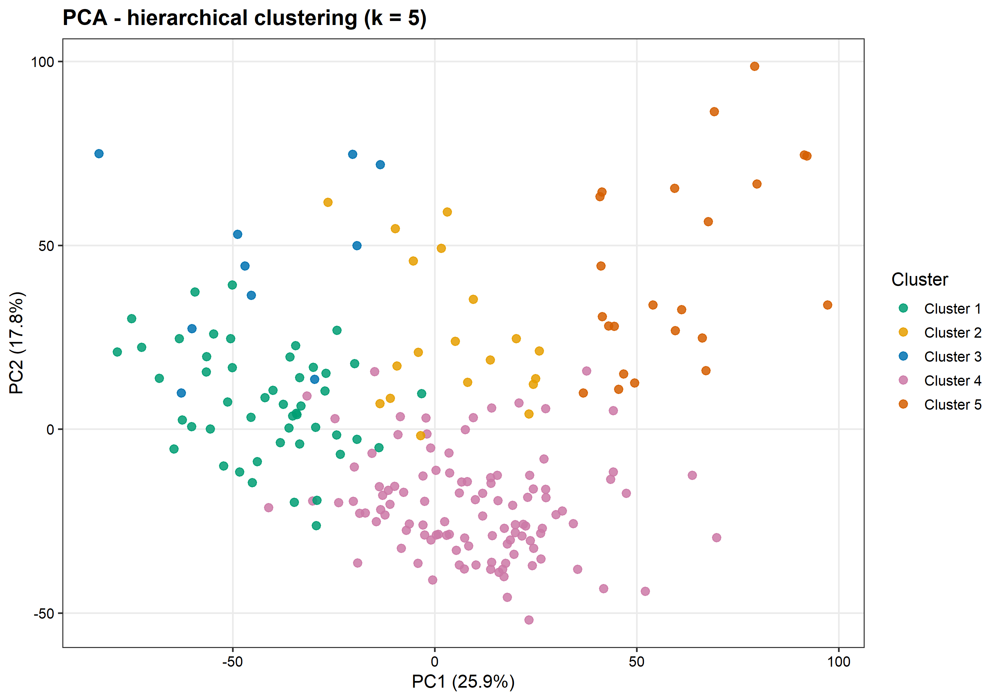

# Unsupervised transcriptomic classification of rheumatoid arthritis synovial tissue

Reproducible R workflow for comparing unsupervised clustering methods in bulk RNA-seq data from rheumatoid arthritis synovial tissue. The analysis evaluates eight algorithms at a working resolution of five clusters and characterises the selected hierarchical solution through differential expression, Reactome enrichment, histological composition and clinical variables.

## Main findings

- Hierarchical clustering provided the best joint performance among the eight methods evaluated at `k = 5`: mean silhouette `0.1275` and mean bootstrap ARI `0.6226`.
- The five-cluster solution contained 210 samples, with cluster sizes of 49, 19, 10, 109 and 23.
- Its agreement with histological pathotypes was limited (ARI `0.1839`), supporting the interpretation that transcriptomic and histological classifications capture related but non-equivalent dimensions of synovial heterogeneity.
- All five clusters showed differential-expression and Reactome-enrichment patterns. These results are exploratory and do not establish clinical subtypes or treatment predictors.
- In the sensitivity analysis across `k = 2–10`, `k = 3` maximised silhouette and bootstrap stability. Therefore, `k = 5` is presented as the prespecified working resolution used to investigate finer heterogeneity, not as the mathematical optimum of those two metrics.



## Repository structure

```text
data/                 Public sample metadata and instructions for input data
pipeline/             Main workflow and modular R functions
scripts/              Post-processing, enrichment and sensitivity analyses
results/figures/      Final figures used to report the analysis
results/tables/       Aggregate result tables
results/enrichment/   Reactome summary and analysis metadata
```

Obsolete scripts, duplicate figures, draft documents, raw count data, local R libraries and sample-level clinical exports are intentionally excluded.

## Data

The workflow uses the publicly available STRAP cohort associated with ArrayExpress/BioStudies accession [E-MTAB-13733](https://www.ebi.ac.uk/biostudies/arrayexpress/studies/E-MTAB-13733). Public sample metadata are included in `data/E-MTAB-13733.sdrf.txt`. The expression-count object is not redistributed; see [`data/README.md`](data/README.md) for the expected local filename.

## Reproducing the analysis

Run commands from the repository root with R 4.5 or a compatible recent version.

```r
Rscript pipeline/STRAP_pipeline_main.R
Rscript scripts/generate_final_numeric_results.R
Rscript scripts/run_functional_enrichment.R
Rscript scripts/analyse_k_selection.R
Rscript scripts/analyse_clinical.R
```

The main pipeline installs missing CRAN and Bioconductor dependencies by default and writes a fresh run to `analysis_output/`. The post-processing scripts write publication-ready summaries to `results/`.

The complete pipeline includes variance filtering and a Kruskal–Wallis feature-selection step informed by histological categories. Clustering itself is unsupervised, but the overall feature-selection procedure is therefore not fully label-independent. This design was used to retain biologically relevant signal and should be assessed in future work using an entirely independent feature-selection strategy.

## Analysis outline

1. Load counts and public metadata.
2. Apply variance and histology-informed feature filtering, followed by variance-stabilising transformation.
3. Compute dimensionality reductions.
4. Compare hierarchical, k-means, spectral, consensus, Leiden, MCL, NMF and Gaussian-mixture clustering at `k = 5`.
5. Evaluate silhouette width and bootstrap stability; compare histology only post hoc.
6. Characterise the selected hierarchy using one-versus-rest differential expression.
7. Perform local Reactome over-representation analysis of upregulated genes.
8. Examine sensitivity to `k` and the distribution of clinical variables across clusters.

Numeric cluster identifiers are retained to avoid assigning definitive biological labels before post-hoc characterisation.

## Notes on interpretation

The results describe molecular structure in one heterogeneous cohort. They are suitable for hypothesis generation and methodological evaluation, but external validation is required before clinical use.

## Author

Paula Morales Sandoica — Master's thesis in Bioinformatics, Universidad Europea de Madrid.
