# Clasificación No Supervisada de Patotipos de Tejido Sinovial en Artritis Reumatoide
### Análisis Transcriptómico de la Cohorte STRAP (ArrayExpress E-MTAB-13733)

---

## Descripción general

La artritis reumatoide (AR) no es una enfermedad única — es un espectro de patologías sinoviales con composiciones celulares y programas moleculares distintos. La clasificación histopatológica define tres patotipos canónicos: **Fibroide**, **Mieloide** y **Linfoide**. Sin embargo, si estas categorías son realmente discretas a nivel transcriptómico, o si se funden en un paisaje continuo, sigue siendo una pregunta abierta.

Este proyecto aplica clustering no supervisado a datos de RNA-seq masivo (*bulk*) de la cohorte STRAP (n ≈ 300 biopsias sinoviales) para responder a: *¿puede la expresión génica por sí sola reconstruir subgrupos biológicamente significativos que se alineen con — o vayan más allá de — la clasificación canónica de patotipos?*

El pipeline compara **8 métodos de clustering** (K-means, Jerárquico, Espectral, Consensus, Leiden, Louvain, Infomap, MCL), selecciona la solución más robusta y caracteriza cada cluster mediante expresión diferencial, firmas génicas de AR conocidas y comparación con el diagnóstico histológico.

---

## Principales hallazgos

> **K-means con k = 4 identifica cuatro subgrupos transcriptómicos.** Tres se alinean ampliamente con los patotipos canónicos Fibroide, Mieloide y Linfoide. Un cuarto, denominado *Subtipo4*, co-segrega con muestras histológicamente Linfoides pero porta una identidad molecular distinta, lo que sugiere una subdivisión previamente no resuelta del estado sinovial rico en tejido linfoide.

| Patotipo | Color | n (aprox.) | Biología dominante |
|----------|-------|-----------|-------------------|
| **Fibroide** | 🔴 | ~55 | Activación estromal, presentación de antígenos (genes HLA), remodelación de la ECM |
| **Mieloide** | 🔵 | ~10 | Programa inflamatorio innato; cluster pequeño, transcriptómicamente concentrado |
| **Linfoide** | 🟢 | ~40 | Actividad ribosomal/traduccional (RPL28, RPS19); infiltración de células T/B |
| **Subtipo4** | 🟣 | ~110 | Firma tipo macrófago CD163⁺, tráfico de células inmunes (PLXNB2), respuesta al estrés |

---

## Reducción dimensional

Se utilizaron dos enfoques complementarios para visualizar el paisaje transcriptómico:

- **PCA** — captura la estructura de varianza lineal; PC1 (22,2%) y PC2 (21,8%) explican juntas ~44% de la varianza total.
- **Mapas de Difusión** — captura la geometría no lineal y las trayectorias biológicas; ejes recortados al percentil 2,5–97,5 para evitar el colapso por outliers.

<table>
<tr>
<th align="center">PCA — Solución K-means</th>
<th align="center">Mapa de Difusión — Solución K-means</th>
</tr>
<tr>
<td>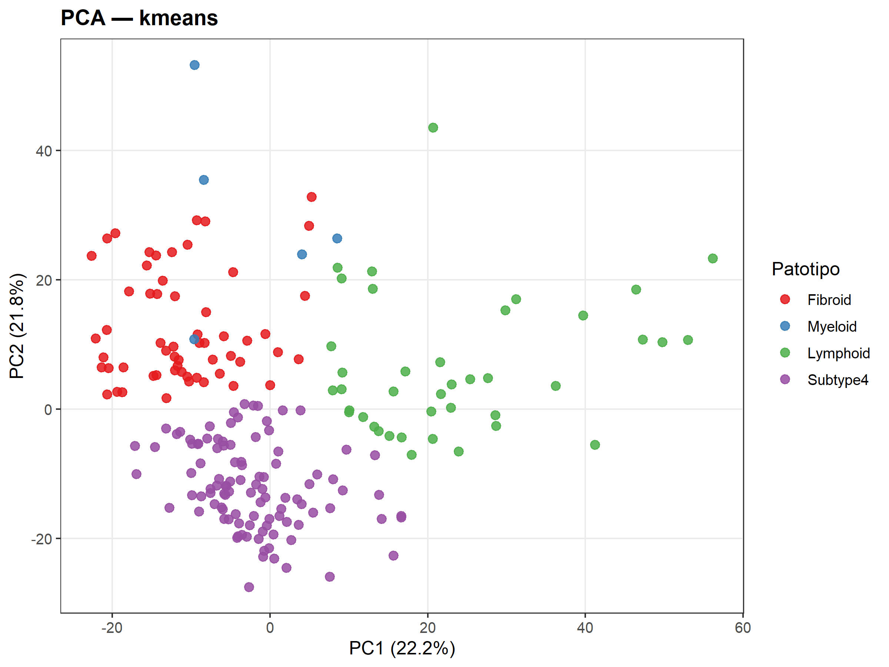</td>
<td>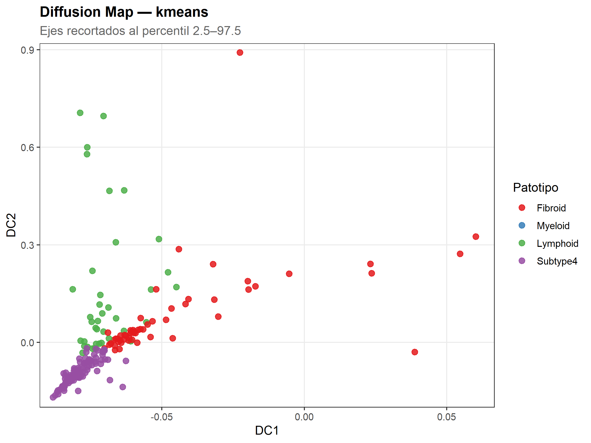</td>
</tr>
</table>

**Lectura del PCA:** Fibroide (rojo) se agrupa en el cuadrante superior izquierdo; Linfoide (verde) se extiende hacia PC1 positivo; Subtipo4 (morado) forma una masa densa en la parte inferior; Mieloide (azul) es un grupo pequeño y espacialmente diferenciado. La separación es real pero no nítida — coherente con el conocido continuo biológico de los patotipos de AR.

**Lectura del Mapa de Difusión:** La geometría no lineal revela una **trayectoria diagonal llamativa para Subtipo4**, lo que sugiere que representa un estado continuo más que un subtipo discreto. Las muestras Fibroides se distribuyen a lo largo de un brazo separado. Mieloide aparece casi aislado, indicando una alta especificidad transcriptómica a pesar de su pequeño tamaño.

---

## Los cuatro patotipos — Interpretación a nivel de cluster

### 🔴 Fibroide

El cluster Fibroide es el segundo más grande y muestra la composición más compleja en la matriz de confusión: ~48% de sus muestras provienen de tejido histológico Fibroide, pero ~33% proceden del histológico Mieloide. Esta mezcla indica que a nivel transcriptómico, los programas estromal e inflamatorio innato coexisten en una fracción sustancial de muestras.

**Principales marcadores DEG (sobreexpresados):** *PRKAR2B, MTURN, GSN, MAOA, CD74, HLA-DRA, HLA-DMB, HLA-DPB1, HLA-DPA1*

La prevalencia de **genes HLA de clase II** (HLA-DRA, HLA-DMB, HLA-DPB1, HLA-DPA1) es biológicamente informativa: son las moléculas del complejo mayor de histocompatibilidad responsables de la presentación de antígenos a los linfocitos T CD4⁺. Su sobreexpresión en el cluster Fibroide puede reflejar que los fibroblastos sinoviales (FLS) en este estado participan activamente en la presentación local de antígenos, difuminando la frontera entre funciones estromales e inmunes. *GSN* (gelsolina, proteína de remodelación de actina) y *MAOA* (monoaminooxidasa A) apuntan a la dinámica del citoesqueleto y a componentes neuroinflamatorios.

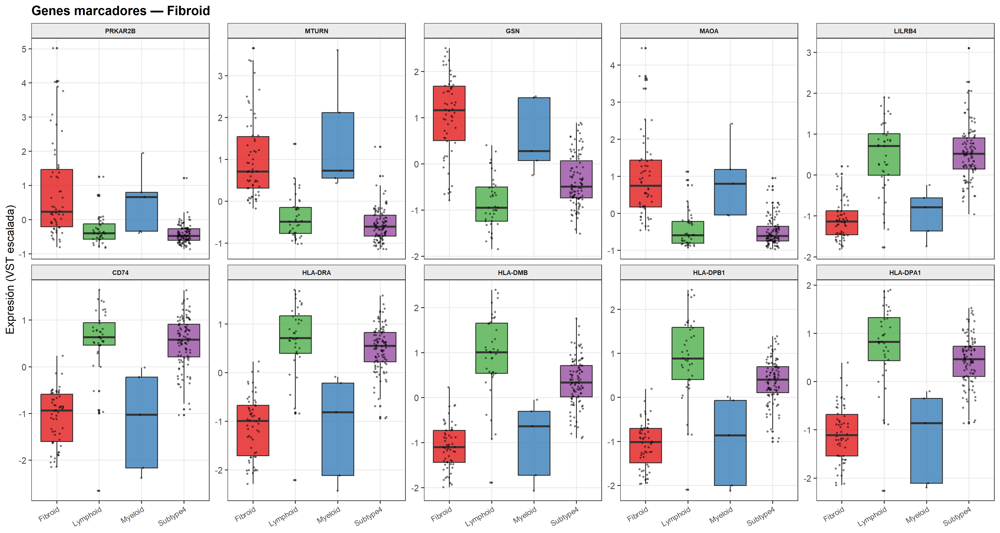

---

### 🔵 Mieloide

El cluster Mieloide es el más pequeño en número de muestras (~10), lo cual es la razón principal por la que solo se recuperó un gen DEG estadísticamente significativo tras el análisis DESeq2 uno-contra-resto. A pesar de su tamaño, el **60% de sus muestras proceden de tejido histológico Mieloide** — la mayor pureza de patotipo entre los cuatro clusters.

**Principal marcador DEG:** *ZFP36L1* — una proteína de unión a ARN que desestabiliza ARNm proinflamatorios (TNF, IL-6). Su infraexpresión en las muestras Mieloides sugiere un deterioro del amortiguamiento post-transcripcional de las señales inflamatorias, coherente con el estado de macrófago hiperactivado característico del patotipo Mieloide.

**Característica notable — TNNC1 y CRYAB:** En el boxplot de marcadores de Subtipo4, *TNNC1* (troponina C1) y *CRYAB* (αB-cristalina) aparecen dramáticamente elevados específicamente en las muestras Mieloides. Ambas son proteínas de respuesta al estrés expresadas en fibroblastos bajo estrés mecánico o térmico, y CRYAB tiene roles documentados en la supervivencia de macrófagos. Su alta expresión aquí puede reflejar co-activación de fibroblastos sinoviales dentro de biopsias Mieloides, o una subpoblación adaptada al estrés.

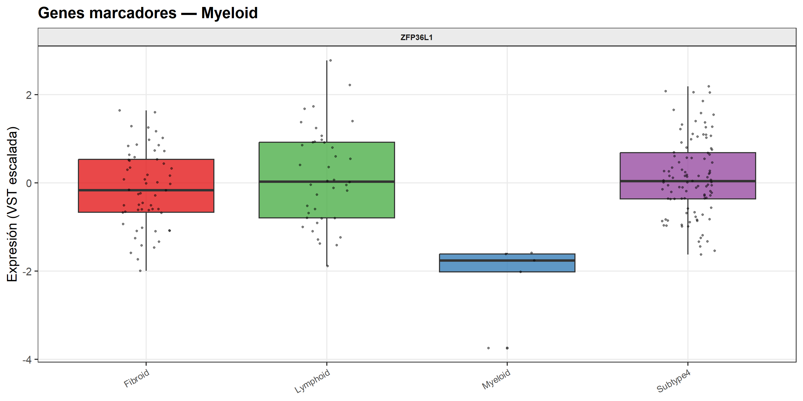

---

### 🟢 Linfoide

El cluster Linfoide logra el mayor solapamiento con un único patotipo: **el 70% de sus muestras proceden de tejido histológico Linfoide**. Su perfil DEG se centra en proteínas ribosomales (*RPL28, RPS19*) y componentes de la matriz extracelular (*LAMB2*).

La sobreexpresión de **proteínas ribosomales** en el cluster Linfoide no es trivial. Los linfocitos activados y en expansión — como ocurre en las estructuras similares a centros germinales del sinovio en AR — incrementan dramáticamente la maquinaria traduccional para sostener la rápida proliferación y la producción de anticuerpos y citocinas. Esta firma transcripcional se alinea con la biología conocida de los agregados linfoides (AL) en el sinovio de AR.

*LAMB2* (subunidad beta-2 de laminina) es un componente estructural de las membranas basales. Su expresión diferencial entre Linfoide y otros clusters puede reflejar la remodelación vascular necesaria para mantener la organización de los agregados linfoides.

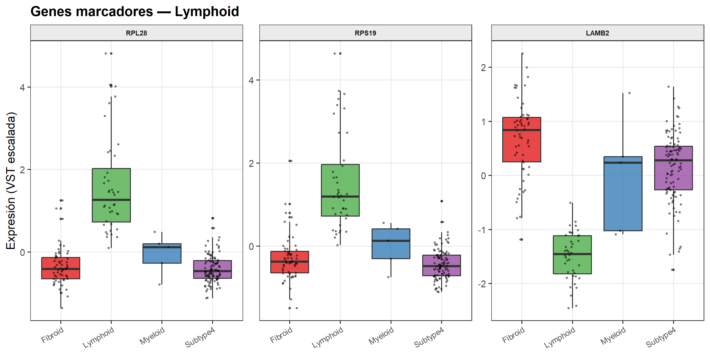

---

### 🟣 Subtipo4 — Un candidato a subdivisión linfoide

Subtipo4 es el cluster más grande y el resultado biológicamente más inesperado de este análisis. Su perfil en la matriz de confusión refleja al Linfoide: **el 70,9% de sus muestras llevan etiquetas histológicas Linfoides**, casi idéntico al cluster Linfoide. Sin embargo, su perfil de expresión génica es fundamentalmente diferente.

**Principales marcadores DEG (sobreexpresados):** *CD163, PLXNB2, HSP90B1, ADIRF, TPP1*  
**Principales marcadores DEG (infraexpresados):** *TNNC1, CRYAB*

*CD163* es un receptor scavenger y marcador definitivo de macrófagos activados de forma alternativa (tipo M2). Su sobreexpresión posiciona a Subtipo4 como enriquecido en **actividad macrofágica inmunosupresora o antiinflamatoria**, en contraste con el sesgo proinflamatorio esperado en las muestras Mieloides canónicas.

*PLXNB2* (Plexina B2) media la quimiotaxis de células inmunes y se expresa en células dendríticas y macrófagos durante la vigilancia tisular. *HSP90B1* (GRP94) es una chaperona del retículo endoplasmático crítica para las proteínas de la vía secretora, incluyendo los complejos MHC de clase I/II — lo que apunta a una maquinaria de procesamiento de antígenos activa.

**Interpretación:** Subtipo4 puede representar un **estado sinovial rico en linfoides dominado por macrófagos reguladores o activados de forma alternativa**, más que el programa inmune clásicamente citotóxico o efector del cluster Linfoide. Si se valida, esta distinción tendría implicaciones terapéuticas: las estrategias antiinflamatorias convencionales podrían comportarse de forma diferente en estos dos subgrupos histológicamente indistinguibles pero transcriptómicamente separables.

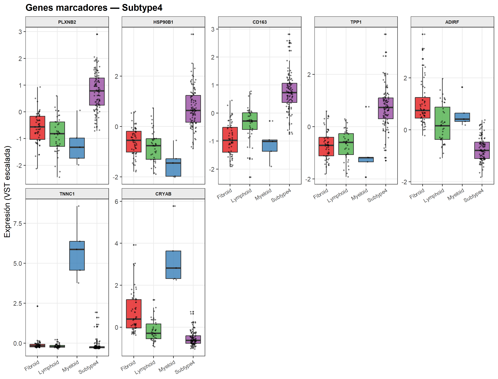

---

## Validación frente al diagnóstico histológico

### Matriz de confusión

La matriz de confusión cuantifica, para cada cluster predicho, qué fracción de sus muestras procede de cada patotipo histológico.

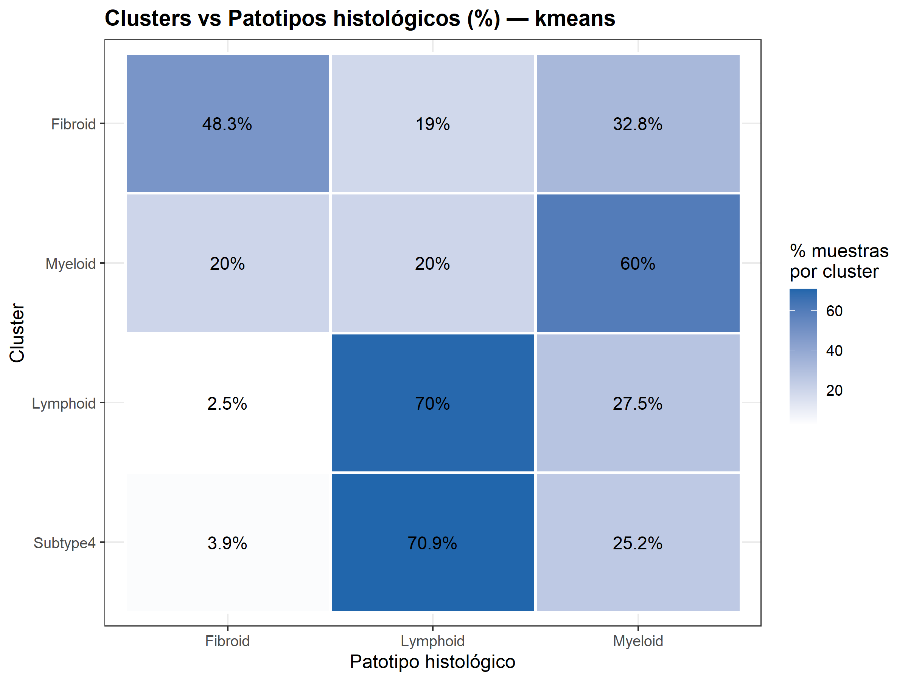

Observaciones clave:
- Cluster **Linfoide**: 70% Linfoide histológico → mayor pureza, recuperación biológica más sólida
- Cluster **Mieloide**: 60% Mieloide histológico → alta pureza, pero cluster muy pequeño
- **Subtipo4**: 70,9% Linfoide histológico → subgrupo transcriptómicamente distinto dentro de la categoría Linfoide
- **Fibroide**: 48,3% Fibroide histológico → cluster más heterogéneo; estado estromal-inmune mixto

### Diagrama de Sankey — Flujo de muestras entre predicción y diagnóstico

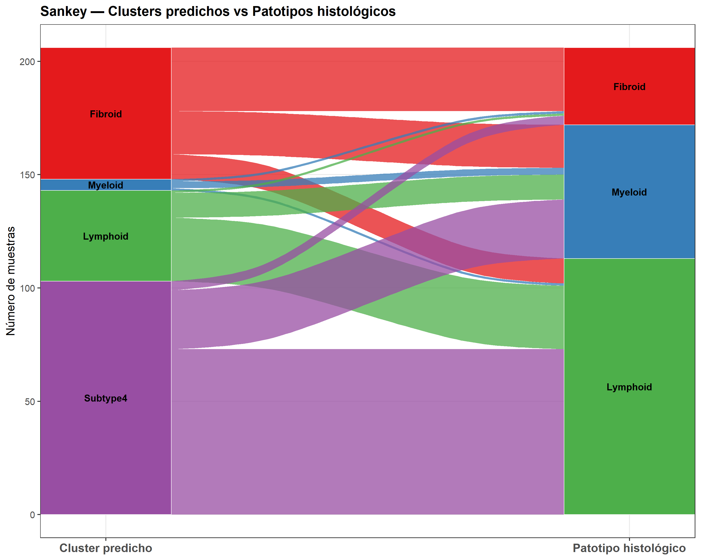

El diagrama de Sankey hace el flujo entre clusters inmediatamente legible. La característica más notable es el **doble flujo desde el Linfoide histológico** hacia los clusters verde (Linfoide) y morado (Subtipo4) — evidencia visual directa de la subdivisión linfoide propuesta. La banda Mieloide a la izquierda es delgada, reflejando su pequeño tamaño, pero su flujo se concentra hacia el Mieloide histológico a la derecha.

---

## Heatmap — Estructura global de expresión

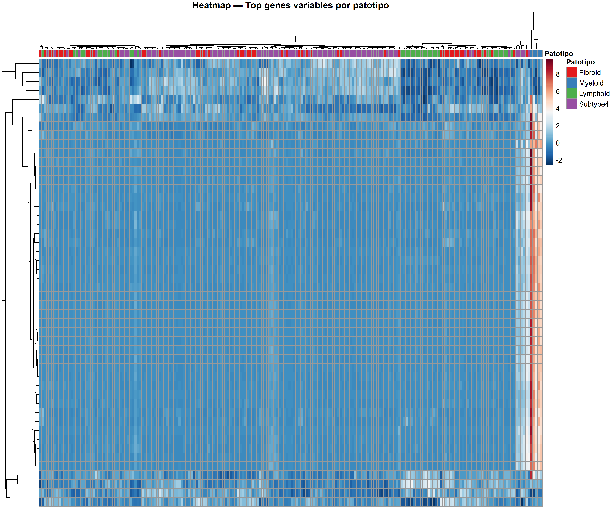

El heatmap de los genes más variables por patotipo confirma una estructura en bloques: las columnas (muestras) se agrupan por patotipo con separaciones visibles en la barra de color. El patrón más prominente es una **franja cálida en las muestras Mieloides**, correspondiente a un pequeño conjunto de genes altamente específicos de este cluster. Los bloques Fibroide y Subtipo4 son grandes pero relativamente uniformes, coherente con su presencia dominante en el dataset.

---

## Comparación de métodos de clustering

Se evaluaron ocho algoritmos sobre la misma matriz de expresión normalizada con VST y escalada con z-score. Se utilizaron dos métricas independientes:

### Validez interna: Silhouette score

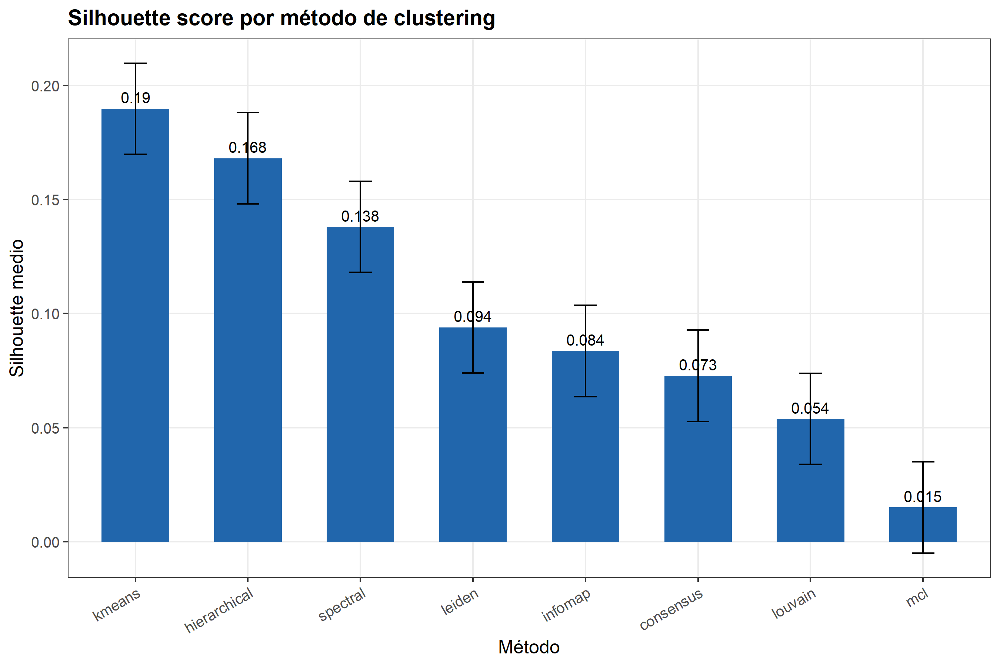

### Estabilidad externa: ARI Bootstrap (Índice de Rand Ajustado)

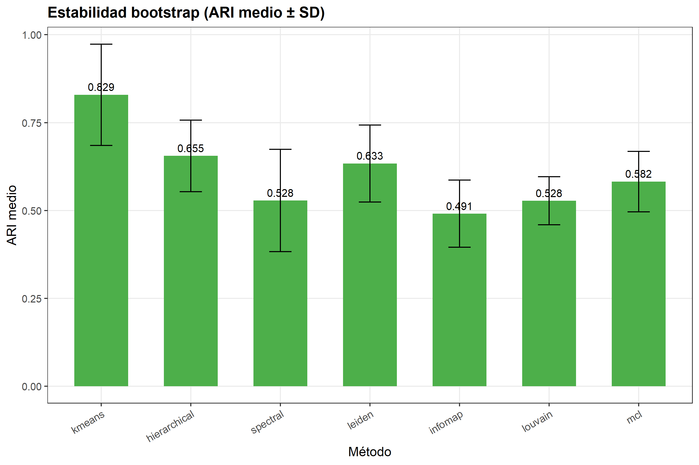

| Método | Silhouette | ARI Bootstrap | Veredicto |
|--------|-----------|--------------|-----------|
| **K-means** | **0,19** | **0,829** | ✅ Mejor en general — alta estabilidad, mayor silhouette |
| Jerárquico | 0,168 | 0,655 | ✅ Segundo más sólido |
| Espectral | 0,138 | 0,528 | Moderado |
| Leiden | 0,094 | 0,633 | Método de grafo, estabilidad aceptable |
| Infomap | 0,084 | 0,491 | Límite |
| Consensus | 0,073 | — | Por debajo de lo esperado; los clusters pequeños afectan a la convergencia |
| Louvain | 0,054 | 0,528 | Genera clusters extra más allá de k=4 |
| MCL | 0,015 | 0,582 | Separación casi aleatoria para estos datos |

**Por qué gana K-means:** Los datos transcriptómicos, preprocesados en el espacio PCA tras la normalización VST, tienen una **geometría aproximadamente euclídea** que favorece los métodos basados en centroides. Los métodos de grafo (Leiden, Louvain, MCL) están diseñados para datos con estructura de variedad (*manifold*) como el RNA-seq de célula única, y tienen un rendimiento inferior en matrices de RNA-seq masivo donde los grafos de vecindad local son menos informativos.

El **ARI bootstrap de 0,829** para K-means significa que cuando el mismo algoritmo se re-ejecuta sobre submuestras del 80% de los datos, las particiones resultantes concuerdan con la solución completa el 83% de las veces (por concordancia corregida por azar). Es un resultado sólido que justifica usar K-means como solución de referencia.

---

## Una reflexión sobre la continuidad biológica

Un silhouette score de 0,19, siendo el mejor entre todos los métodos, sigue siendo bajo en términos absolutos. Esto es esperado y biológicamente significativo: **los patotipos sinoviales de AR no son entidades moleculares discretas**. Cada biopsia contiene una mezcla heterogénea de tipos celulares, y el RNA-seq masivo mide un promedio poblacional. El clustering revela ejes transcriptómicos dominantes, pero los pacientes existen a lo largo de un continuo más que en categorías perfectamente delimitadas.

El descubrimiento de Subtipo4 como posible subdivisión Linfoide ilustra esto: la histología lo colapsa en la categoría Linfoide, pero el transcriptoma lo separa. Este hallazgo motiva trabajo futuro con resolución de célula única o transcriptómica espacial, donde la resolución a nivel de tipo celular podría resolver las interacciones macrófago-linfocito hipotetizadas en Subtipo4.

---

## Arquitectura del pipeline

El análisis está implementado como un pipeline modular en R. Un único parámetro global (`k <- 4` en `STRAP_pipeline_main.R`) controla el número de patotipos en todos los pasos.

```
STRAP_pipeline_main.R          ← Punto de entrada; todos los parámetros globales aquí
functions/
  00_setup.R                   ← Instalación de paquetes y creación de directorios de salida
  01_preprocessing.R           ← Carga de conteos, normalización VST, escalado z-score
  02_dimreduction.R            ← PCA (prcomp) + Mapas de Difusión (diffusionMap)
  03_clustering.R              ← 8 algoritmos de clustering (modular, fácilmente extensible)
  04_validation.R              ← Silhouette + ARI bootstrap
  05_annotation.R              ← Firmas génicas de AR → nombrado automático de patotipos
  06_visualization.R           ← Todas las figuras (ggplot2, pheatmap, ggalluvial)
  07_deg_analysis.R            ← DESeq2 uno-contra-resto; tablas UP/DOWN separadas por cluster
  08_export.R                  ← Exportación organizada a results/
results/
  figures/                     ← 21 figuras listas para publicación (PNG, 300 ppp)
  tables/                      ← Asignaciones de clusters, ranking de validación
  DEGs/                        ← Genes sobre- e infraexpresados por patotipo
  clusters/                    ← Vectores de clusters + gráficos de consensus
  validation/                  ← Resultados de bootstrap y silhouette
```

Para reproducir el análisis completo, abre `STRAP_pipeline_main.R` en RStudio y pulsa **Source**. El directorio de trabajo se establece automáticamente.

---

## Datos

- **Cohorte:** STRAP (*Stratification of Biologic Therapies for RA by Pathobiology*)
- **Acceso:** ArrayExpress [E-MTAB-13733](https://www.ebi.ac.uk/biostudies/arrayexpress/studies/E-MTAB-13733)
- **Tipo de datos:** RNA-seq masivo, biopsias de tejido sinovial
- **Referencia histológica:** Etiquetas de patotipo Fibroide, Mieloide y Linfoide de los metadatos SDRF asociados

---

## Dependencias

R ≥ 4.4. Paquetes principales: `DESeq2`, `ConsensusClusterPlus`, `clusterProfiler`, `igraph`, `kernlab`, `diffusionMap`, `MCL`, `ggplot2`, `ggalluvial`, `pheatmap`, `mclust`. La lista completa se gestiona automáticamente mediante `functions/00_setup.R`.

---

*Trabajo de Fin de Máster en Bioinformática — Análisis de patotipos de tejido sinovial en artritis reumatoide mediante clasificación transcriptómica no supervisada.*
