# Clasificación No Supervisada de Patotipos de Tejido Sinovial en Artritis Reumatoide
### Análisis Transcriptómico de la Cohorte STRAP (ArrayExpress E-MTAB-13733)

---

## Descripción general

La artritis reumatoide (AR) no es una enfermedad única — es un espectro de patologías sinoviales con composiciones celulares y programas moleculares distintos. La clasificación histopatológica define tres patotipos canónicos: **Fibroide**, **Mieloide** y **Linfoide**. Estudios posteriores han descrito un cuarto patotipo transcriptómico, **IFN-high**, con implicaciones terapéuticas específicas.

Sin embargo, la mayoría de estos estudios utilizan métodos supervisados o scoring de firmas génicas predefinidas. Este trabajo evalúa si métodos de clustering completamente **no supervisados** aplicados a datos bulk RNA-seq son capaces de recuperar esta estructura biológica de forma independiente, y qué métodos son más robustos para ello.

El pipeline compara **8 métodos de clustering** — métodos clásicos (K-means, Jerárquico, Espectral, Consensus), basados en grafos (Leiden, MCL) y específicos para bulk RNA-seq (NMF, GMM) —, selecciona la solución más robusta mediante silhouette y bootstrap ARI, y caracteriza cada cluster a través de expresión diferencial, firmas génicas de AR y comparación con el diagnóstico histológico.

---

## Principales hallazgos

> **K-means con k=5 identifica cuatro estados transcriptómicos biológicamente interpretables** en el sinovio de AR, más un quinto cluster que representa un artefacto de calidad de biopsia. El análisis redescubre de forma independiente el patotipo **IFN-high** previamente descrito por métodos supervisados, validando la capacidad del pipeline. Adicionalmente, identifica un **estado vascular/angiogénico** (EMCN⁺, JAM2⁺, AQP1⁺) que trasciende las fronteras histológicas clásicas y no está recogido en la clasificación canónica.

| Patotipo | Color | n | Biología dominante | Pureza histológica |
|----------|-------|---|-------------------|-------------------|
| **Fibroide** | 🔴 | 18 | Activación estromal, presentación antigénica HLA, FLS KRT⁺ | 72% Fibroide |
| **Vascular-Estromal** | 🔵 | 67 | EMCN⁺ JAM2⁺ AQP1⁺ — firma endotelial/angiogénica | 43% Mieloide, mixto |
| **Linfoide** | 🟢 | 77 | Linfocitos activos (RPL28, RPS19), agregados linfoides | 79% Linfoide |
| **IFN-high** ⭐ | 🟣 | 39 | Respuesta interferónica, RF⁺, implicaciones terapéuticas | 72% Linfoide |
| ~~Subtype4~~ | 🟠 | 5 | ⚠️ Artefacto: contaminación muscular (TNNI1, NEB) en pacientes masculinos con CRP alta | — |

> **Nota sobre Subtype4:** El análisis clínico reveló 80% de pacientes masculinos (vs. 12–30% en el resto), CRP media 51.4 mg/L y expresión extrema de proteínas de músculo esquelético (TNNI1, NEB). Consistente con contaminación de tejido muscular adyacente en biopsias de pacientes masculinos con alta actividad inflamatoria periarticular. Excluido de la interpretación biológica principal.

---

## Reducción dimensional

<table>
<tr>
<th align="center">PCA — Solución K-means (k=5)</th>
<th align="center">Mapa de Difusión — K-means (k=5)</th>
</tr>
<tr>
<td>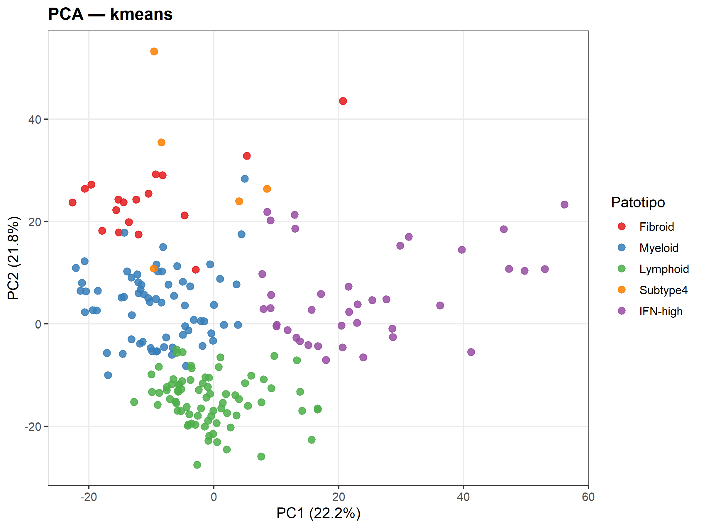</td>
<td>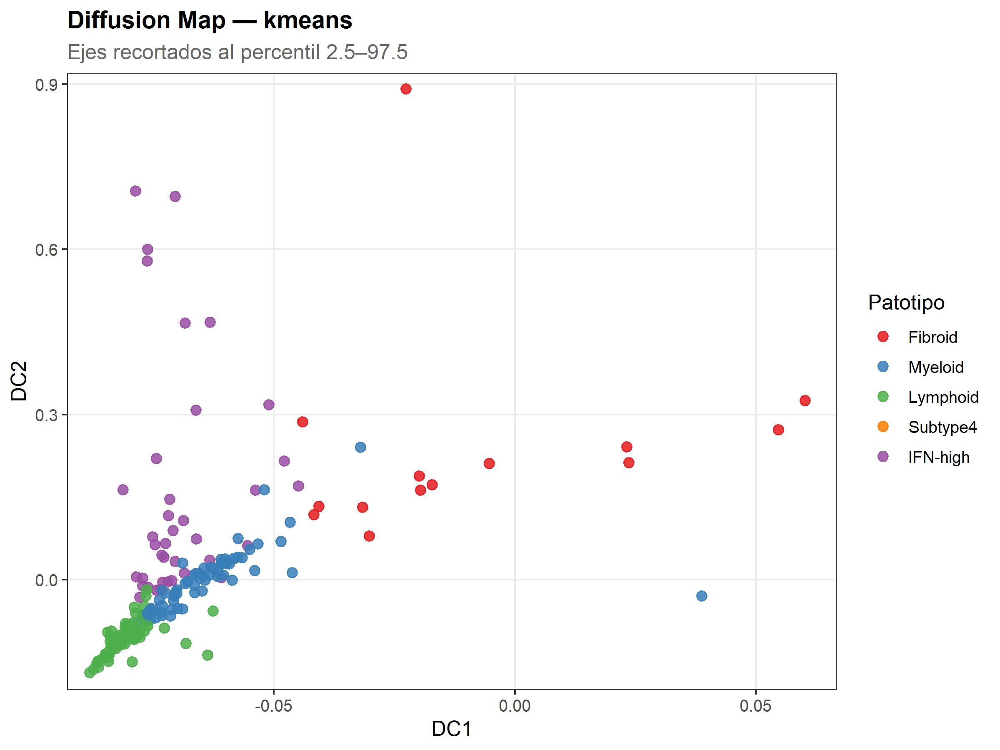</td>
</tr>
</table>

**PCA:** Fibroide (rojo) se concentra en el cuadrante superior-izquierdo; Linfoide (verde) forma un bloque compacto en la parte inferior; IFN-high (morado) se extiende hacia PC1 positivo; el cluster Vascular-Estromal (azul) ocupa la región central.

**Mapa de Difusión:** IFN-high (morado) ocupa la zona superior-izquierda con DC2 elevado, revelando una rama propia en el espacio no lineal. Linfoide forma el cluster más compacto en el extremo inferior-izquierdo. La geometría confirma que IFN-high y Fibroide tienen trayectorias topológicas independientes.

---

## Los cuatro patotipos — Interpretación biológica

### 🔴 Fibroide

El cluster Fibroide alcanza una pureza del **72%** respecto al patotipo histológico (frente al 48% en k=4). Sus marcadores DEG están dominados por **genes HLA de clase II** (HLA-DRA, HLA-DMB, HLA-DPB1, HLA-DPA1) y queratinas (KRT5, KRT14).

La sobreexpresión de **HLA clase II** indica que los fibroblastos sinoviales (FLS) en este estado participan activamente en la **presentación de antígenos a linfocitos T CD4⁺**, difuminando la frontera clásica entre funciones estromales e inmunes. La presencia de **KRT5 y KRT14** en FLS ha sido documentada en subtipos específicos de la membrana sinovial lining y puede reflejar un fenotipo de diferenciación particular.

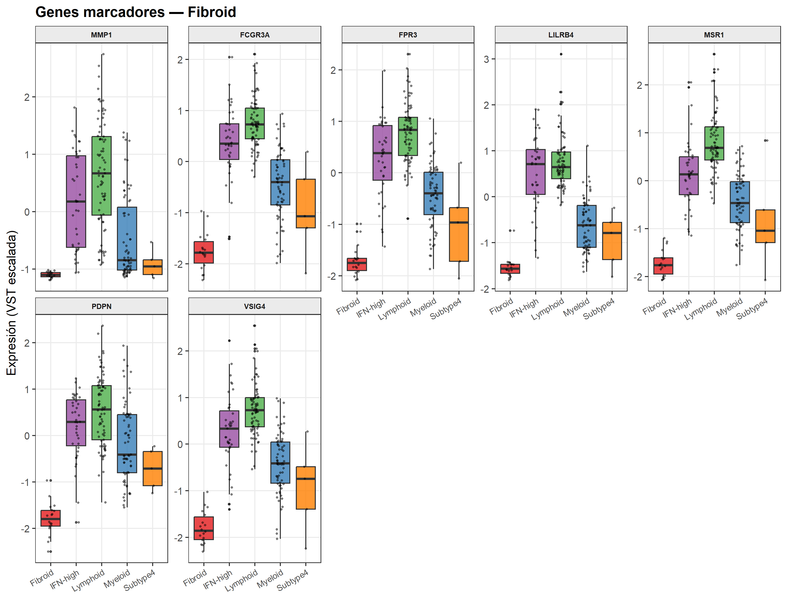

---

### 🔵 Vascular-Estromal *(denominado "Myeloid" por el anotador automático)*

Este es el hallazgo más inesperado del análisis. Aunque el algoritmo de anotación lo denomina "Myeloid" por proceso de eliminación al comparar con firmas génicas conocidas, los DEGs revelan una **firma endotelial/vascular inequívoca**:

| Gen UP | Función | Tipo celular |
|--------|---------|-------------|
| **EMCN** | Endomucina — marcador histológico exclusivo de endotelio vascular | Endotelio |
| **JAM2** | Molécula de adhesión de uniones estrechas endoteliales | Endotelio |
| **AQP1** | Canal de agua en microvasculatura sinovial | Endotelio / FLS |
| **SPARCL1** | Glicoproteína matricelular reguladora de angiogénesis | Endotelio / estroma |
| **PKN3** | Quinasa pro-angiogénica (vía VEGF) | Endotelio |
| **TRPC1** | Canal de calcio endotelial | Endotelio |
| **TNFRSF11B** | OPG — regula RANKL/osteoclastogénesis, producida en endotelio | Endotelio / FLS |

**¿Por qué es histológicamente mixto (43% Mieloide, 33% Linfoide, 24% Fibroide)?** Porque el endotelio vascular está presente en *todos* los patotipos. Las biopsias donde la señal endotelial domina sobre el infiltrado inmune caen en este cluster independientemente de su clasificación histológica. Esto sugiere que la **remodelación vascular/angiogénesis** representa un eje de variación transcriptómica independiente de los patotipos clásicos, no capturado por la clasificación histológica actual.

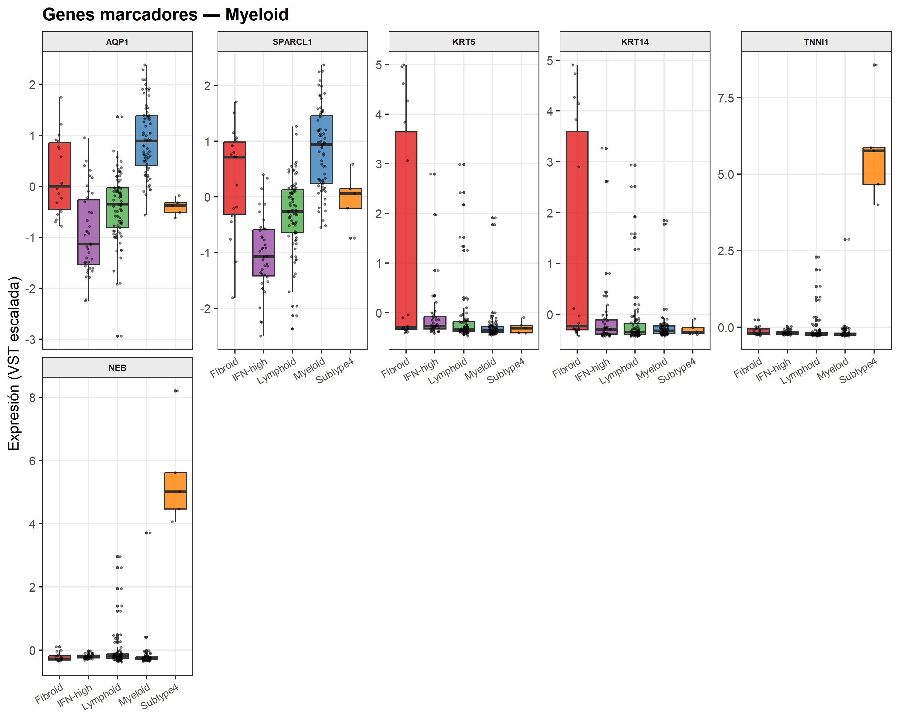

---

### 🟢 Linfoide

El cluster Linfoide alcanza **79% de pureza** histológica. Sus marcadores (RPL28, RPS19, LAMB2) apuntan a **linfocitos transcricionalmente muy activos**. La sobreexpresión de proteínas ribosomales es coherente con linfocitos en expansión dentro de **agregados linfoides terciarios**, estructuras bien documentadas en el sinovio de AR que sostienen respuestas autoinmunes locales.

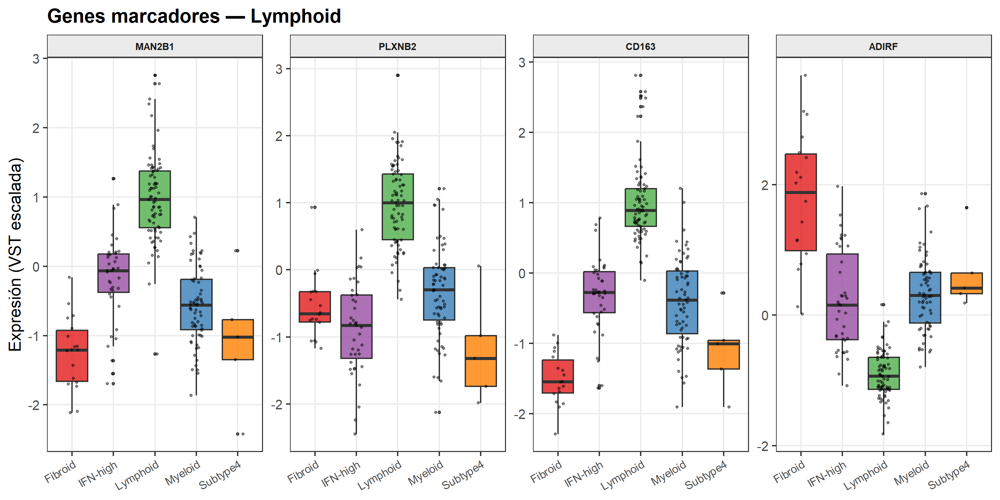

---

### 🟣 IFN-high — Patotipo con relevancia terapéutica directa

**IFN-high es el hallazgo más clínicamente relevante.** El hecho de que un algoritmo no supervisado lo separe del Linfoide — siendo histológicamente idénticos (72% vs 79% Linfoide histológico) — valida tanto la existencia biológica del patotipo como la capacidad del pipeline.

**Perfil clínico** (metadatos STRAP, n=39):
- **66.7% RF positivo** — mayor seropositividad de todos los clusters
- **CRP media 28.5 mg/L** — inflamación sistémica elevada
- **82.1% femenino** — demografía AR típica

Este perfil coincide exactamente con lo descrito en la literatura: pacientes **seropositivos, con mayor inflamación**, y con mejor respuesta documentada a **baricitinib** (JAK1/2) y **abatacept**, y potencial resistencia a anti-TNF *(Boyle et al. 2021, Ann Rheum Dis)*.

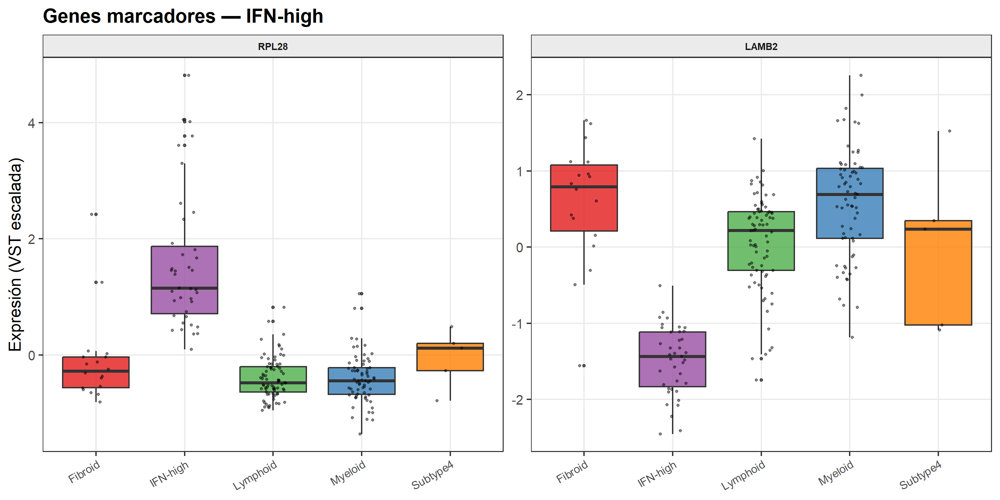

---

## Validación frente al diagnóstico histológico

### Matriz de confusión

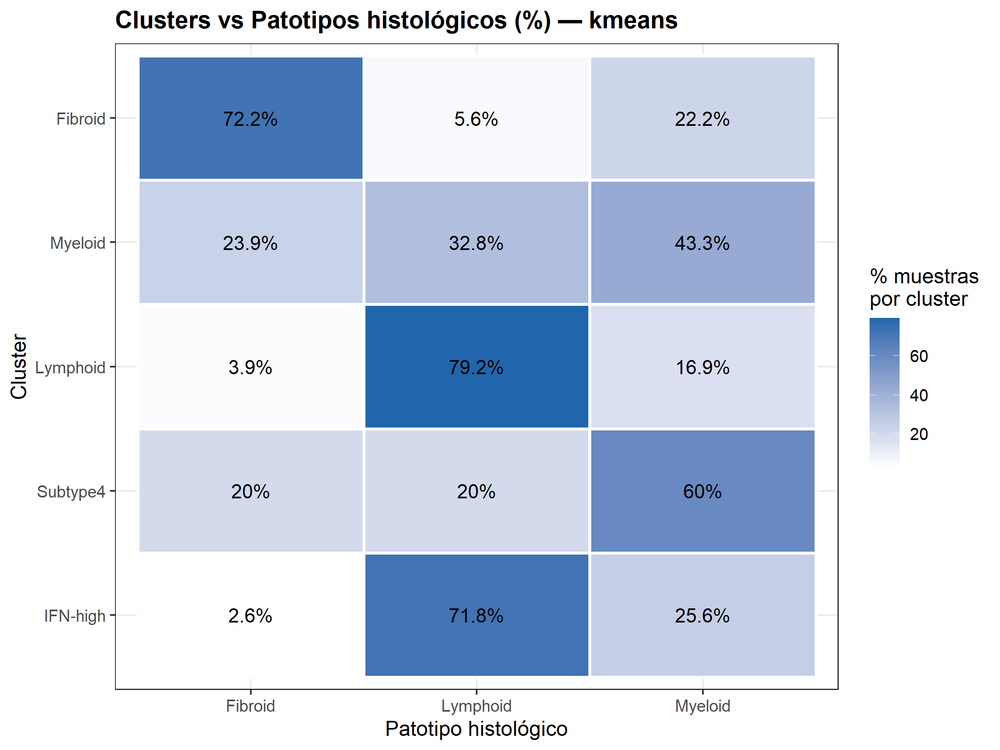

### Diagrama de Sankey

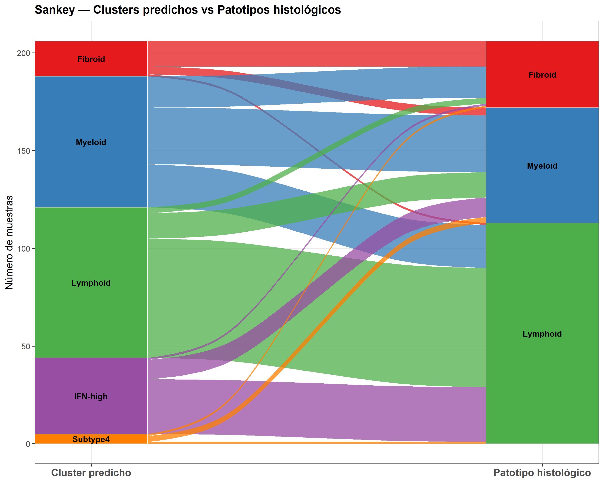

El Sankey visualiza el **doble flujo desde el Linfoide histológico** hacia los clusters Linfoide e IFN-high — evidencia directa de que el transcriptoma separa dos estados que la histología colapsa en uno. Este es el resultado central del análisis.

---

## Heatmap — Estructura global de expresión

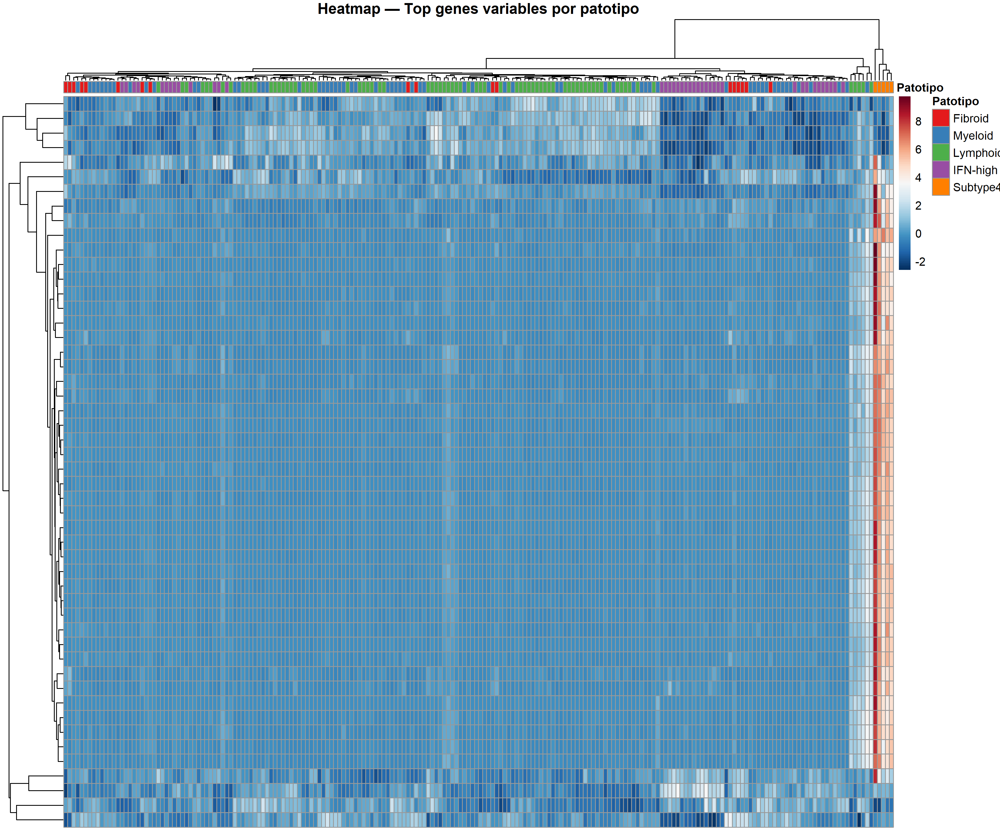

---

## Comparación de métodos de clustering

<table>
<tr>
<th align="center">Silhouette score (validez interna)</th>
<th align="center">Bootstrap ARI (estabilidad)</th>
</tr>
<tr>
<td>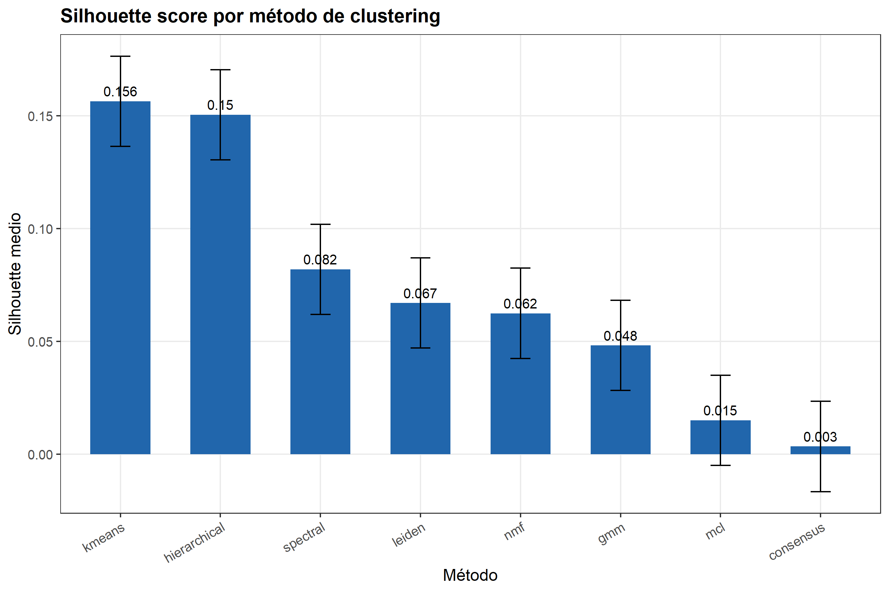</td>
<td>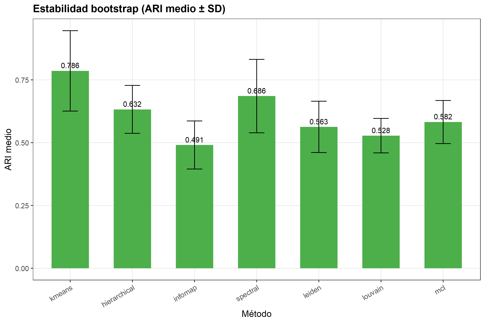</td>
</tr>
</table>

| Método | Silhouette (k=5) | Bootstrap ARI | Veredicto |
|--------|-----------------|---------------|-----------|
| **K-means** | **0.156** | **0.786** | ✅ Mejor en separación y estabilidad |
| Jerárquico | 0.150 | 0.632 | ✅ Segundo más sólido |
| Espectral | 0.082 | 0.686 | Moderado |
| Leiden | 0.067 | 0.563 | Genera clusters adicionales |
| NMF | 0.062 | 0.282 | Inestable — baja reproducibilidad bootstrap |
| GMM | 0.048 | 0.128 | Inestable — insuficientes muestras para gaussianas |
| MCL | 0.015 | 0.582 | Separación casi aleatoria |
| Consensus | 0.003 | — | Inestable con clusters pequeños |

Se compararon métodos clásicos (K-means, jerárquico, spectral, consensus), basados en grafos (Leiden, MCL) y específicos para datos de expresión génica bulk (NMF, GMM). **K-means es el único método que combina alta separación interna (silhouette 0.156) con alta estabilidad bootstrap (ARI 0.786)**, siendo seleccionado como método definitivo.

La baja estabilidad de NMF (ARI=0.282) indica que la variación transcriptómica en biopsias sinoviales forma estados discretos robustos más que un continuo de programas superpuestos — lo que justifica retrospectivamente el uso de clustering duro. Los métodos de grafo (Leiden, MCL) producen muestras "Unresolved", confirmando que bulk RNA-seq sinovial tiene geometría esencialmente euclídea, sin la topología de variedad no lineal de datos single-cell.

---

## Una reflexión sobre la continuidad biológica

Un silhouette de 0.156 es bajo en términos absolutos, pero **biológicamente esperado**: cada biopsia sinovial contiene mezcla de fibroblastos, macrófagos, linfocitos y células endoteliales. El clustering revela ejes transcriptómicos dominantes, no categorías perfectamente separadas.

La separación de IFN-high del Linfoide — histológicamente idénticos — ilustra precisamente el valor del enfoque no supervisado. Y la identificación del cluster Vascular-Estromal apunta a que la **angiogénesis sinovial** podría ser un eje de variación independiente no recogido en la clasificación histológica actual.

---

## Arquitectura del pipeline

```
STRAP_pipeline_main.R          ← Punto de entrada; cambiar k aquí
functions/
  00_setup.R                   ← Instalación de paquetes
  01_preprocessing.R           ← Carga de conteos, VST, z-score
  02_dimreduction.R            ← PCA + Mapas de Difusión
  03_clustering.R              ← 8 algoritmos de clustering (modular)
  04_validation.R              ← Silhouette + bootstrap ARI
  05_annotation.R              ← Firmas AR → nombrado automático
  06_visualization.R           ← 22 figuras (ggplot2, pheatmap, ggalluvial)
  07_deg_analysis.R            ← DESeq2 uno-contra-resto; tablas UP/DOWN
  08_export.R                  ← Exportación organizada
results_k4/                    ← Resultados con k=4
results_k5/                    ← Resultados con k=5 (solución principal)
subtype4_clinical_check.R      ← Validación clínica del cluster artefacto
```

Cada valor de k guarda sus resultados en carpeta independiente. Para reproducir el análisis completo, abrir `STRAP_pipeline_main.R` en RStudio y pulsar **Source**.

---

## Datos

- **Cohorte:** STRAP (*Stratification of Biologic Therapies for RA by Pathobiology*)
- **Acceso:** ArrayExpress [E-MTAB-13733](https://www.ebi.ac.uk/biostudies/arrayexpress/studies/E-MTAB-13733)
- **Tipo de datos:** Bulk RNA-seq, biopsias de tejido sinovial
- **n:** ~206 muestras con metadatos clínicos completos

---

## Dependencias

R ≥ 4.4. Paquetes principales: `DESeq2`, `ConsensusClusterPlus`, `igraph`, `kernlab`, `diffusionMap`, `MCL`, `NMF`, `mclust`, `ggplot2`, `ggalluvial`, `pheatmap`. Gestionados automáticamente por `functions/00_setup.R`.

---

*Trabajo de Fin de Máster en Bioinformática — Análisis de patotipos de tejido sinovial en artritis reumatoide mediante clasificación transcriptómica no supervisada.*
