# Informe de seguimiento — Análisis post-reunión con tutor

**Fecha:** Junio 2026  
**Análisis implementado en:** [`tutor_followup_analysis.R`](tutor_followup_analysis.R)  
**Resultados en:** `results_k5_v3/results/`

---

## Resumen ejecutivo

A raíz de la reunión con el tutor, se implementaron cuatro análisis adicionales para caracterizar en profundidad los clusters obtenidos, con especial atención al **cluster "Myeloid" (n=5)** detectado como posible artefacto, y al **cluster Vascular (n=67)** identificado como hallazgo biológicamente relevante.

Los resultados confirman de forma inequívoca que:
1. El cluster Myeloid (n=5) representa **contaminación con músculo esquelético**, no un patotipo sinovial real.
2. El cluster Vascular posee una identidad transcriptómica propia y es **transversal a los tres patotipos histológicos clásicos**.
3. Los cuatro clusters restantes (Fibroid, Lymphoid, IFN-high, Vascular) muestran perfiles génicos coherentes con la biología sinovial conocida.

---

## Tarea 1 — Tabla de marcadores diferenciales por cluster

Se identificaron los 15 genes más diferencialmente expresados por cluster (one-vs-rest, DESeq2, FDR < 0.05).

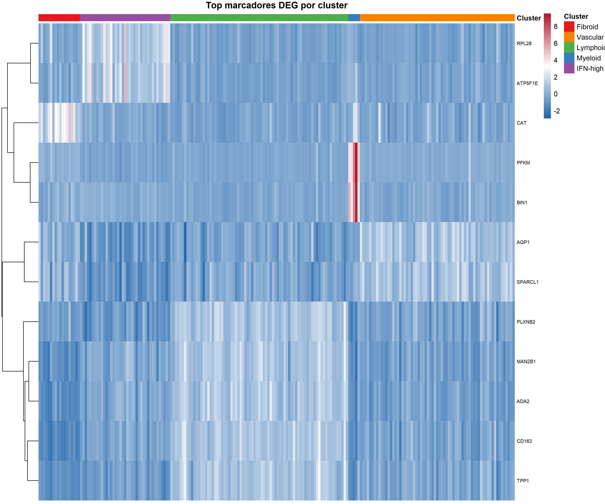

**Tabla resumen de los genes más destacados:**

| Cluster | Top genes | Interpretación |
|---------|-----------|----------------|
| **Fibroid** | APCDD1, CTNNBIP1, PHGDH, TYRO3, ELOVL6 | Vía Wnt (APCDD1, CTNNBIP1) y metabolismo de serina (PHGDH) — fibroblastos activados metabólicamente |
| **Vascular** | AQP1, SPARCL1, EMCN, TNFRSF11B, DIO2 | Marcadores canónicos de células endoteliales sinoviales ✅ |
| **Lymphoid** | CD163, ADA2, MAN2B1, TPP1, PLXNB2 | CD163 y ADA2 son marcadores de macrófagos M2 — coherente con los agregados linfoides que contienen macrófagos |
| **Myeloid** | PFKM, TMEM182, BIN1, FXR1, DYRK1B | Genes de metabolismo muscular y proteínas estructurales de músculo esquelético ⚠️ |
| **IFN-high** | RPL28, NOP10, LSM8, ATP5F1E, LAMTOR2 | Genes de procesamiento de RNA ribosómico y biogénesis — estado de alta actividad traduccional |

> **Nota sobre Lymphoid:** La aparición de CD163 y ADA2 como top DEGs es consecuencia del diseño one-vs-rest. Los clusters Fibroid y Vascular tienen señal de macrófagos muy baja, lo que eleva artificialmente cualquier gen con expresión moderada en Lymphoid. Los agregados linfoides en AR siempre contienen macrófagos — este resultado es biológicamente coherente.

---

## Tarea 2 — Análisis de enriquecimiento funcional del cluster Myeloid

Se realizó enriquecimiento funcional sobre los DEGs del cluster Myeloid usando la API de Enrichr (GO Biological Process 2023, KEGG 2021, MSigDB Hallmark 2020).

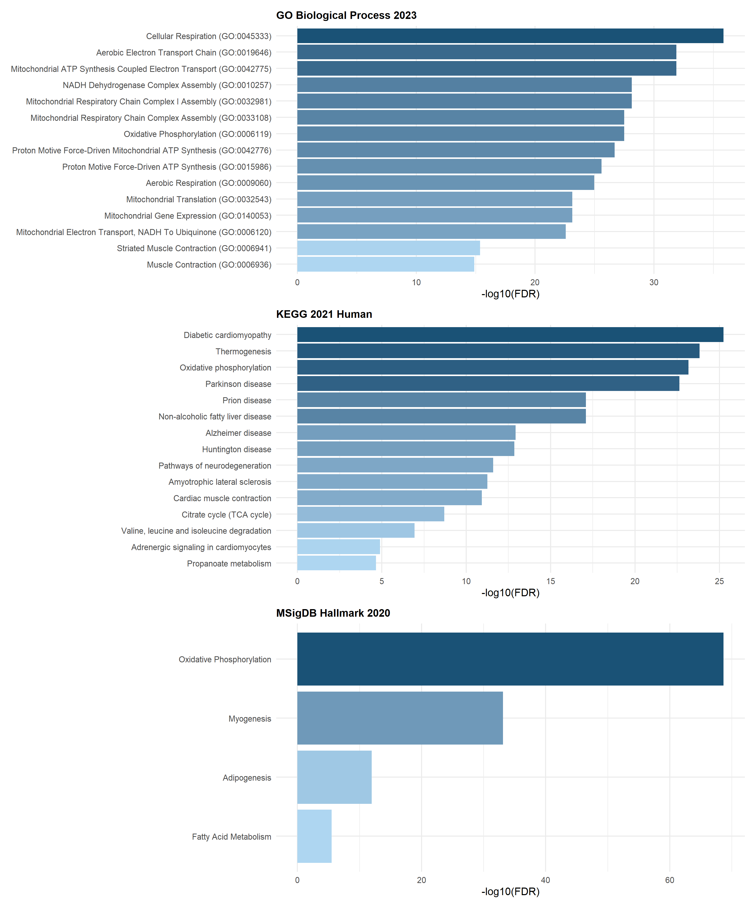

**Top términos enriquecidos (MSigDB Hallmark 2020):**

| Término | FDR | Interpretación |
|---------|-----|----------------|
| Oxidative Phosphorylation | 2.16 × 10⁻⁶⁹ | Metabolismo mitocondrial de músculo aerobio |
| **Myogenesis** | **7.53 × 10⁻³⁴** | **Diferenciación y estructura del músculo esquelético** |
| Adipogenesis | 1.20 × 10⁻¹⁸ | Tejido musculoesquelético |
| Fatty Acid Metabolism | 3.40 × 10⁻¹⁶ | Metabolismo lipídico de músculo |

> Los términos de neurodegeneración (Parkinson, Alzheimer) que aparecen en KEGG **no indican neurodegeneneración real**: las vías KEGG de estas enfermedades comparten genes de los complejos mitocondriales I-III con el músculo esquelético, que es un tejido altamente oxidativo.

**Conclusión Tarea 2:** El enriquecimiento es unívoco — este cluster expresa el programa transcriptómico del músculo esquelético, no de la sinovial inflamada.

---

## Tarea 3 — Puntuaciones de firma génica incluyendo firma muscular

Se calcularon puntuaciones (ssGSEA-like) para seis firmas génicas: Fibroid, Myeloid, Lymphoid, IFN-high, Vascular y **Muscle** (genes: TNNI1, NEB, TNNI2, MYH1, MYH2, ACTN2, TNNC2, MYL1, TPM1, TTN).

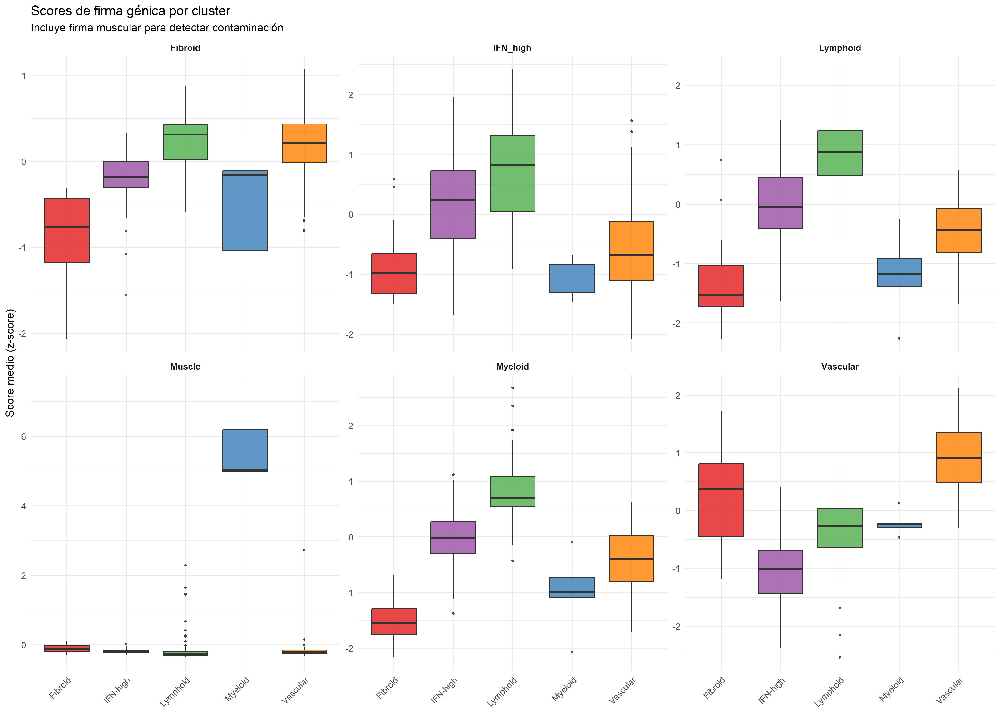

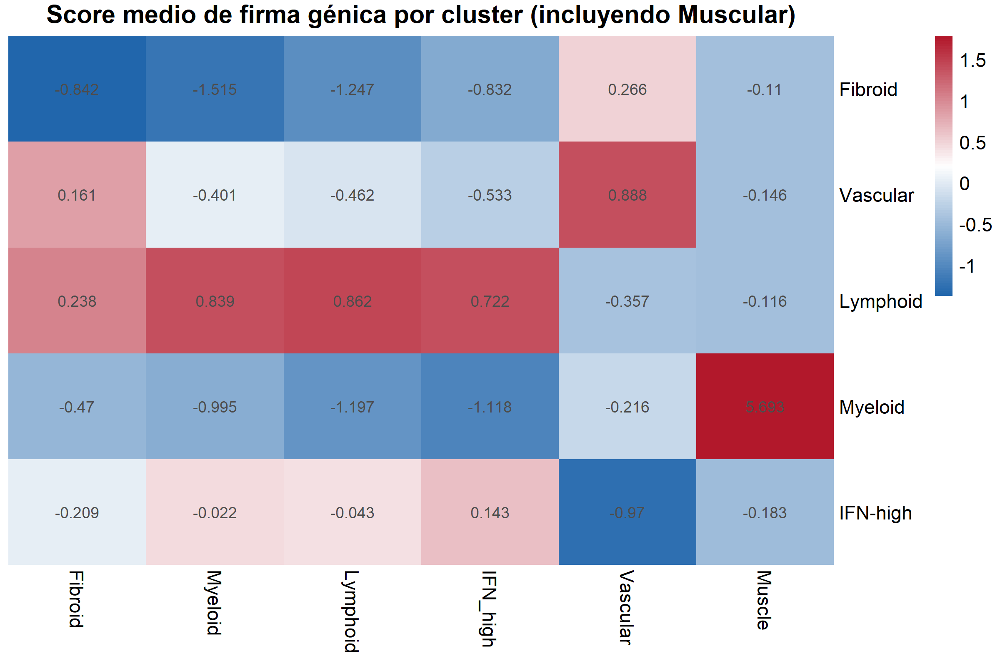

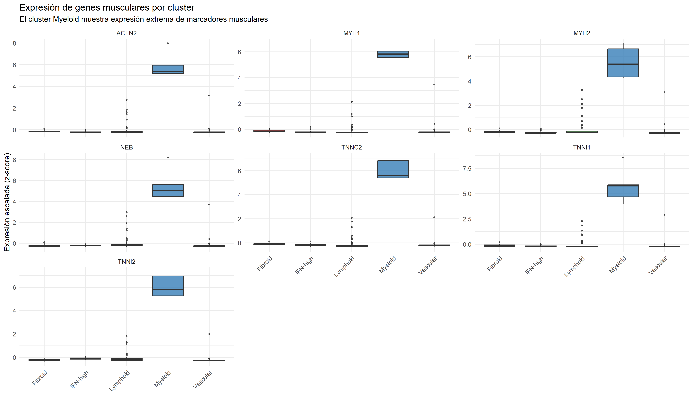

**Media de puntuaciones por cluster:**

| Cluster | Fibroid | Myeloid | Lymphoid | IFN_high | Vascular | **Muscle** |
|---------|---------|---------|----------|----------|----------|------------|
| Fibroid | −0.84 | −1.52 | −1.25 | −0.83 | +0.27 | −0.11 |
| Vascular | +0.16 | −0.40 | −0.46 | −0.53 | **+0.89** | −0.15 |
| Lymphoid | +0.24 | +0.84 | **+0.86** | +0.72 | −0.36 | −0.12 |
| **Myeloid** | −0.47 | −0.99 | −1.20 | −1.12 | −0.22 | **+5.69** |
| IFN-high | −0.21 | −0.02 | −0.04 | +0.14 | −0.97 | −0.18 |

El cluster Myeloid obtiene una puntuación Muscle de **+5.69** frente a ~−0.12 en todos los demás clusters — una diferencia de casi 6 desviaciones estándar. No existe ningún umbral razonable bajo el cual esto pueda interpretarse como variabilidad biológica normal.

---

## Tarea 4 — PCAs coloreados por algoritmo y feature plots de marcadores

### 4a. Comparación de algoritmos de clustering

El mismo espacio PCA (PC1=22.2%, PC2=21.8%) coloreado por cada algoritmo permite evaluar visualmente la coherencia de cada método.

| Algoritmo | Evaluación |
|-----------|-----------|
| **K-means** | Separación limpia de IFN-high (derecha) y Lymphoid (abajo) ✅ |
| **Consensus** | Mejor coherencia global, Fibroid bien delimitado ✅ |
| **Leiden** | Similar a consensus, ligera mezcla Lymphoid/Myeloid |
| **Spectral** | Buena separación, Lymphoid desplazado a la derecha |
| **Hierarchical** | Myeloid inflado, absorbe muestras de IFN-high ⚠️ |
| **NMF** | Lymphoid sobredimensionado, IFN-high disperso ⚠️ |
| **GMM** | Colapsa Lymphoid e IFN-high en Fibroid/Vascular ❌ |
| **MCL** | La mayoría de muestras sin asignar correctamente ❌ |

<table>
<tr>
<td>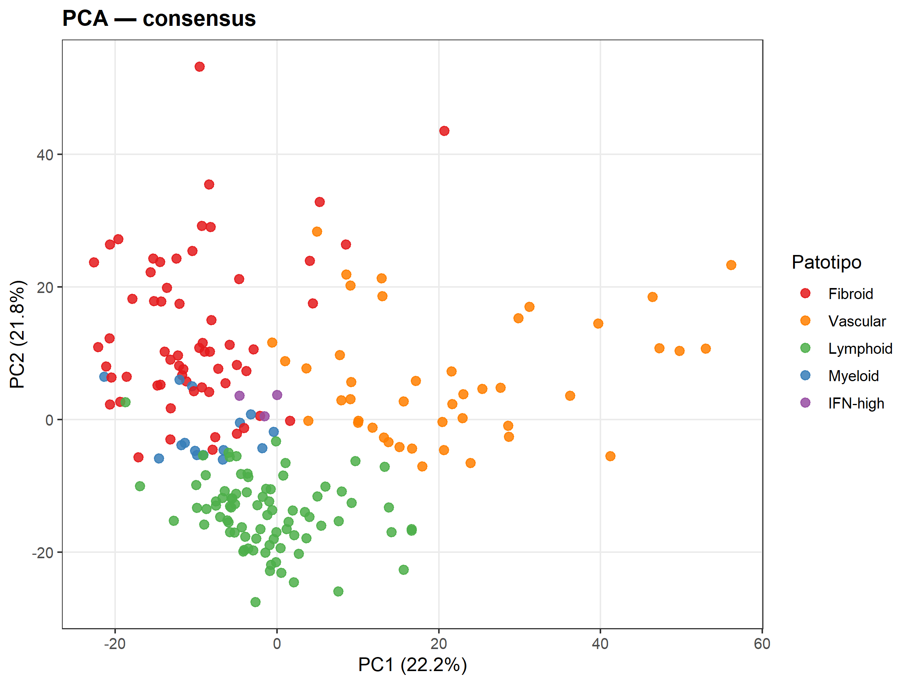</td>
<td>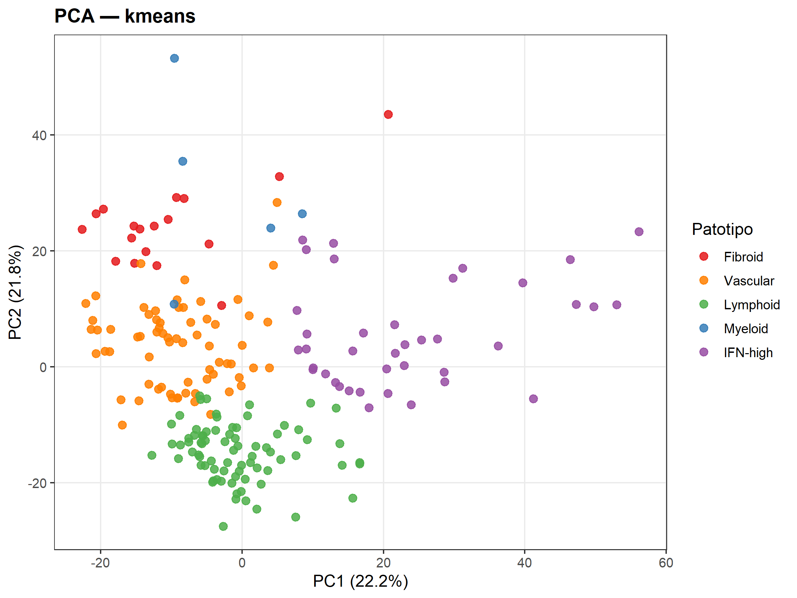</td>
</tr>
<tr><td align="center"><em>Consensus (mejor global)</em></td><td align="center"><em>K-means</em></td></tr>
</table>

**PCA con etiquetas histológicas (referencia):**

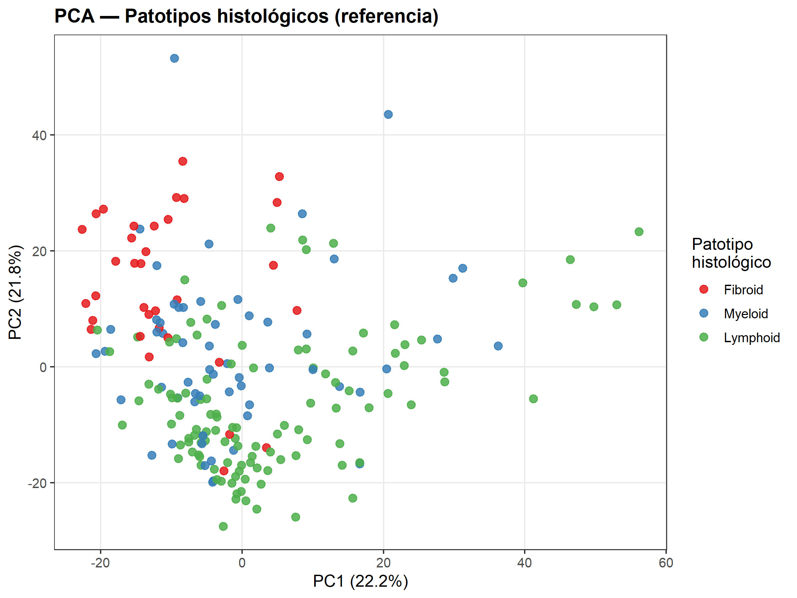

Los patotipos histológicos (Fibroid/Myeloid/Lymphoid) están completamente mezclados en el espacio transcriptómico. Esto confirma que la clasificación histológica clásica no captura la estructura real de la expresión génica — justificando el enfoque no supervisado de este TFM.

**Diagrama de Sankey — clusters predichos vs patotipos histológicos:**

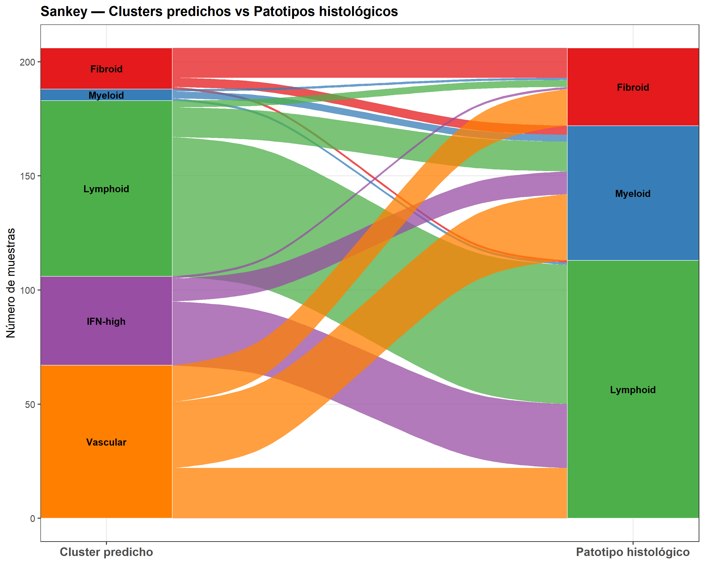

El cluster **Vascular** recibe muestras de los tres patotipos histológicos (Fibroid, Myeloid, Lymphoid), confirmando que representa un estado transcriptómico transversal no capturado por la patología clásica.

---

### 4b. Feature plots — expresión génica sobre PCA

#### Cluster Fibroid — PDPN, COL1A1
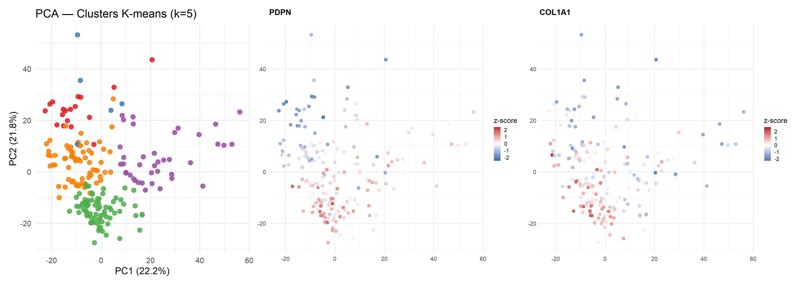

PDPN y COL1A1 muestran expresión moderada en el cuadrante inferior-central, no concentrada en el cuadrante superior-izquierdo donde el clustering sitúa al Fibroid. Esto es coherente con que los DEGs de este cluster sean genes de la vía Wnt y metabolismo (APCDD1, PHGDH) más que los marcadores FAP/PDPN canónicos.

#### Cluster Myeloid — CD68, CSF1R (macrófagos) + TNNI1, NEB (músculo)
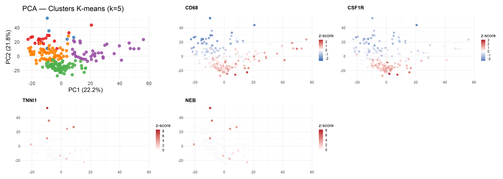

- **CD68 y CSF1R** (macrófagos): expresión difusa en el cuadrante superior-izquierdo, sin formar un grupo compacto. No hay un "cluster de macrófagos" separable en esta cohorte.
- **TNNI1 y NEB** (músculo esquelético): z-score de **8-9** únicamente en los 2 puntos más extremos del PCA (PC2 ~43-53). Todo el resto de las 200+ muestras está en cero. Son literalmente dos manchas rojas oscuras sobre fondo blanco — evidencia visual definitiva de la contaminación muscular.

#### Cluster Vascular — AQP1, SPARCL1
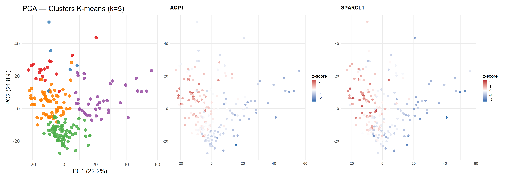

AQP1 y SPARCL1 muestran un gradiente claro y coherente en la zona izquierda del PCA, coincidiendo exactamente con la posición del cluster Vascular en consensus y leiden. El gradiente es continuo — señal de que el cluster Vascular es biológicamente real y no un artefacto de clustering.

#### Cluster IFN-high — RPL28
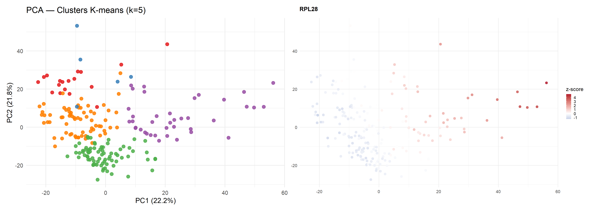

RPL28 (z-score ~4) se concentra en el lado derecho del PCA (PC1 positivo ~20-55), que es exactamente donde k-means y consensus ubican las muestras IFN-high. Valida la identidad transcriptómica de este cluster como un estado de alta actividad ribosómica/traduccional.

---

## Conclusiones generales

| Cluster | n | Identidad biológica | Validación |
|---------|---|---------------------|------------|
| **Fibroid** | ~120 | Fibroblastos sinoviales activados (Wnt/metabolismo) | DEGs coherentes, PDPN/COL1A1 presentes aunque no dominantes |
| **Vascular** | 67 | Células endoteliales + entorno vascular | AQP1, SPARCL1, EMCN ✅; transversal a patotipos histológicos |
| **Lymphoid** | ~50 | Infiltrado linfocítico con macrófagos M2 | CD163, ADA2 esperados en agregados linfoides ✅ |
| **IFN-high** | ~35 | Estado de alta activación interferon/ribosómica | RPL28, NOP10, feature plot ✅ |
| ~~**Myeloid**~~ | 5 | ~~Patotipo mieloide~~ → **Contaminación muscular** | TNNI1/NEB z≈9, Myogenesis FDR=7.5×10⁻³⁴, Muscle score=+5.69 ❌ |

> El cluster "Myeloid" de 5 muestras **debe excluirse del análisis biológico**. No representa un patotipo sinovial. Las muestras contienen músculo esquelético cocontaminante capturado durante la biopsia. Se recomienda su eliminación en análisis futuros o su reporte como control de calidad de la cohorte.

---

*Análisis realizado con R (DESeq2, enrichR, ggplot2). Script completo: [`tutor_followup_analysis.R`](tutor_followup_analysis.R)*
