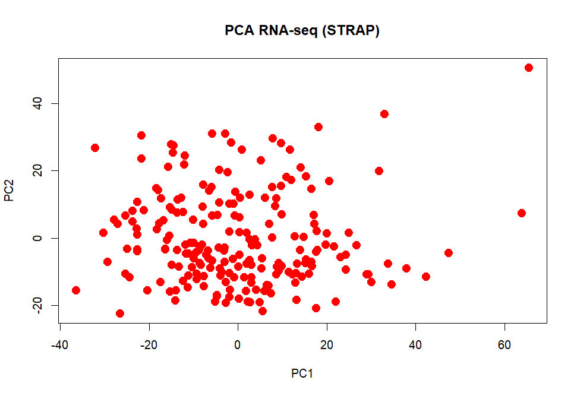
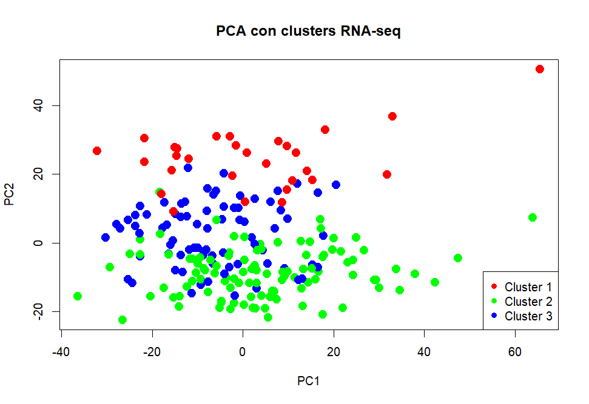
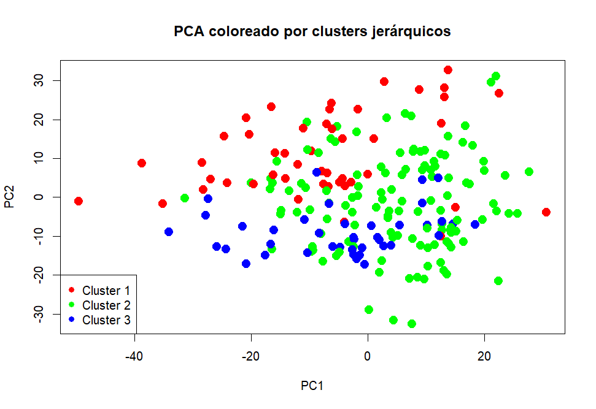
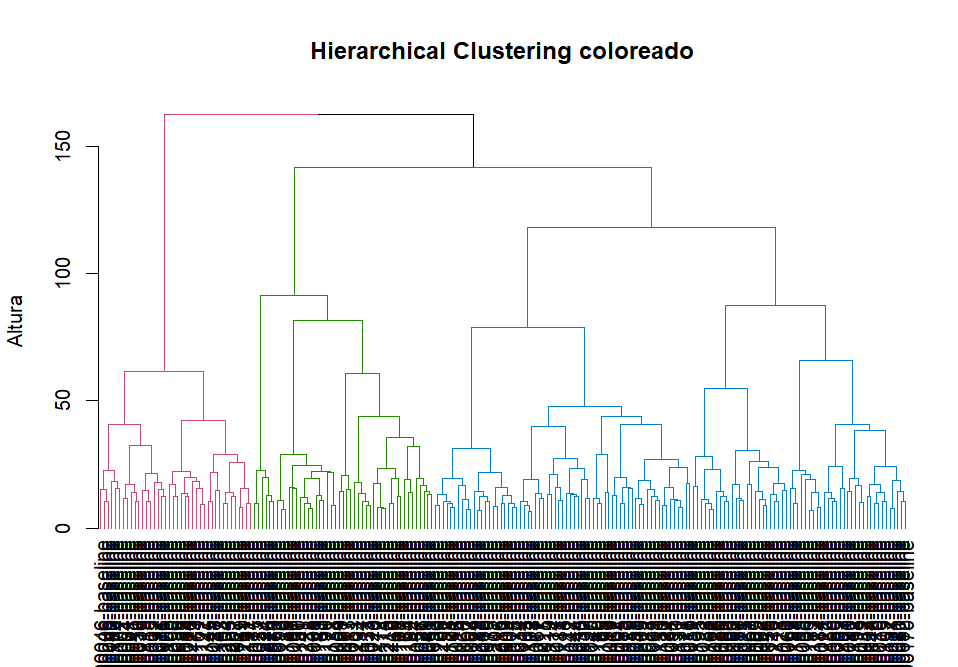
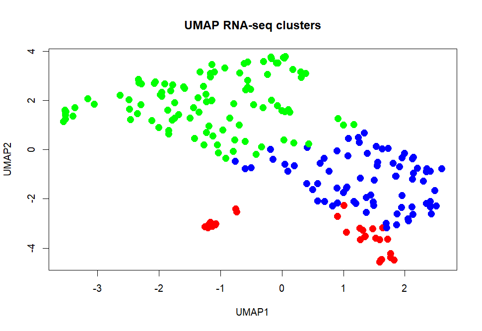
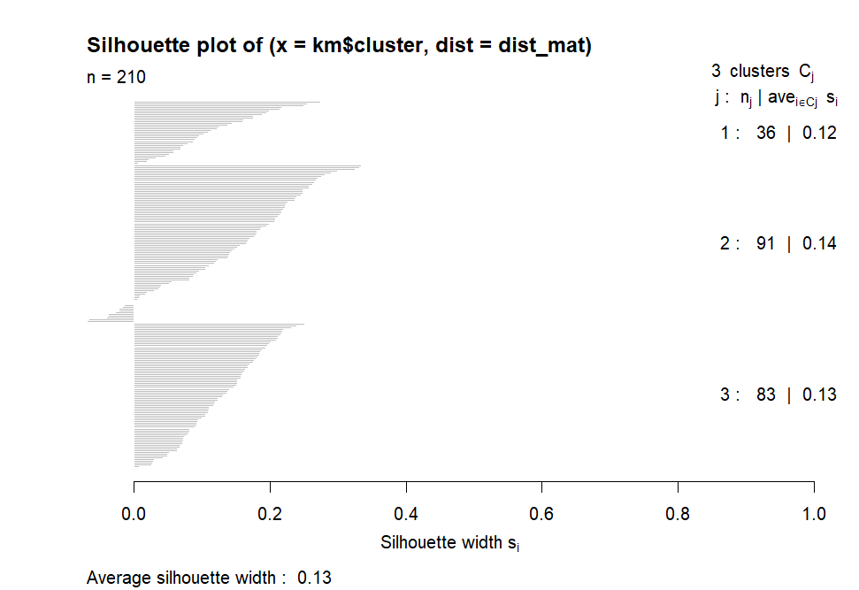
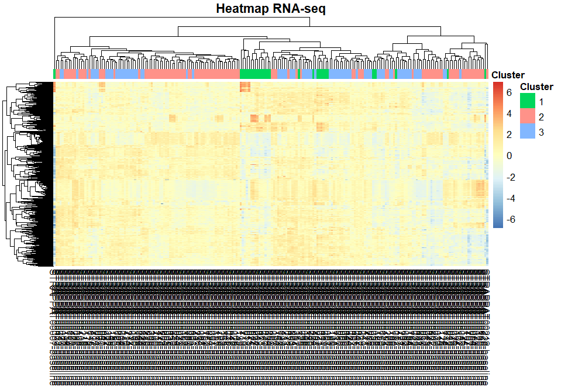
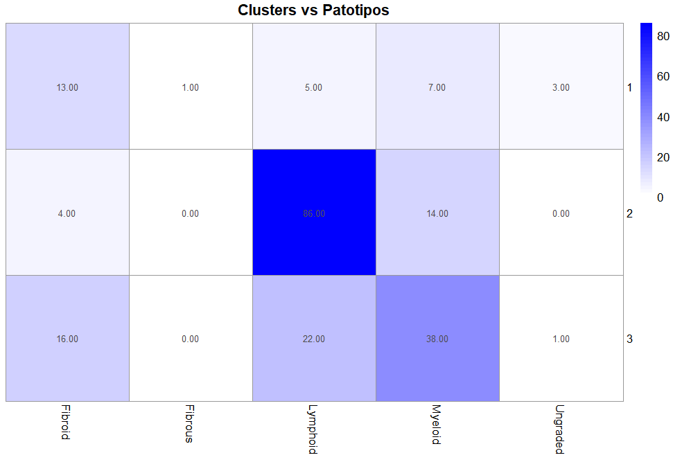
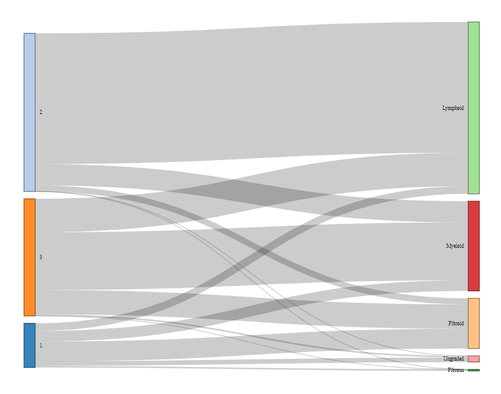

# Análisis de Clustering No Supervisado de Patotipos en Artritis Reumatoide — Datos STRAP

## 1. Descripción del análisis

### 1.1 Tipo de datos

El análisis parte de datos de expresión génica obtenidos mediante RNA-seq del estudio STRAP (*Stratification of Biologic Therapies for Rheumatoid Arthritis by Pathobiology*), accesible a través del repositorio ArrayExpress (E-MTAB-13733). La matriz de conteo contiene muestras de tejido sinovial de pacientes con artritis reumatoide (AR), con el objetivo de identificar subgrupos biológicamente distintos (patotipos) mediante técnicas de aprendizaje no supervisado.

### 1.2 Preprocesamiento

El pipeline de preprocesamiento incluye los siguientes pasos:

1. **Filtrado por varianza**: se calculó la varianza de cada gen a lo largo de todas las muestras y se seleccionaron los 1.000 genes con mayor varianza, descartando así genes con poca capacidad discriminativa.
2. **Transformación logarítmica**: se aplicó una transformación log₂(x + 1) sobre los conteos filtrados para estabilizar la varianza y aproximar la distribución a la normalidad, requisito implícito de muchos métodos de clustering.
3. **Transposición**: la matriz se traspuso para que las filas representasen muestras (n = 210) y las columnas genes (p = 1.000).
4. **Escalado (solo clustering jerárquico)**: para el enfoque jerárquico se aplicó un escalado z-score por gen (`scale()`), centrando y normalizando cada variable. Este paso no se realizó de forma consistente para K-means, lo que puede introducir diferencias entre soluciones.

### 1.3 Métodos de clustering aplicados

Se emplearon dos algoritmos de clustering, ambos configurados con k = 3 clusters:

- **K-means**: particionamiento iterativo basado en minimización de la suma de cuadrados intracluster, aplicado sobre la matriz log-transformada sin escalar.
- **Clustering jerárquico aglomerativo**: con distancia euclídea y método de enlace Ward.D2 (minimización de la varianza intracluster), aplicado sobre la matriz escalada.

### 1.4 Métodos de reducción dimensional y visualización

- **PCA (Análisis de Componentes Principales)**: aplicado con `prcomp(..., scale. = TRUE)` para proyectar las muestras en las dos primeras componentes principales.
- **UMAP (Uniform Manifold Approximation and Projection)**: con parámetros por defecto de la librería `umap`, para visualización no lineal de la estructura local de los datos.
- **Heatmap**: generado con `pheatmap` sobre la expresión log-transformada, escalada por fila, con anotación de clusters K-means.

### 1.5 Evaluación

- **Silhouette score**: calculado sobre la partición K-means con k = 3, usando la distancia euclídea sobre los datos log-transformados.
- **Comparación con patotipos de referencia**: cruce entre las asignaciones de cluster y los patotipos histopatológicos anotados en los metadatos STRAP (Lymphoid, Myeloid, Fibroid, Fibrous, Ungraded), visualizado mediante un heatmap de contingencia y un diagrama de Sankey.

---

## 2. Interpretación biológica de cada gráfico

### **Figura 1 — PCA previo sin clusters (PCA RNA-seq STRAP)**

Este gráfico muestra la proyección de las 210 muestras sobre las dos primeras componentes principales (PC1 vs PC2) sin coloración por cluster, representando la estructura global de la variabilidad transcriptómica.

La distribución presenta una nube de puntos relativamente compacta sin agrupaciones naturales evidentes. Se observan algunos valores atípicos dispersos en la periferia (especialmente una muestra extrema en el cuadrante superior derecho, con PC1 ≈ 65 y PC2 ≈ 50), lo que sugiere la presencia de outliers con perfiles de expresión muy divergentes. La ausencia de separaciones claras en las dos primeras componentes indica que la varianza explicada por PC1 y PC2 no captura diferencias discretas entre subgrupos de pacientes, sino un gradiente continuo de variabilidad. Esto es consistente con la heterogeneidad biológica de la AR y anticipa dificultades para el clustering.

### **Figura 2 — PCA con clusters K-means (PCA con clusters RNA-seq)**

Proyección PCA coloreada según la asignación de K-means (k = 3). Los tres clusters se superponen extensamente en el espacio de las dos primeras componentes principales.

El Cluster 1 (rojo) tiende a ocupar posiciones superiores en PC2, mientras que el Cluster 3 (azul) se concentra en valores negativos-centrales y el Cluster 2 (verde) muestra la mayor dispersión. Sin embargo, la superposición entre los tres grupos es considerable, especialmente en la zona central del gráfico. Esto indica que K-means está particionando un espacio continuo sin fronteras naturales nítidas, lo cual es problemático desde el punto de vista de la validez biológica de los clusters resultantes. La presencia de outliers asignados a clusters específicos (la muestra extrema en el cuadrante superior derecho pertenece al Cluster 1) puede estar sesgando los centroides.

### **Figura 3 — PCA con clusters jerárquicos (PCA coloreado por clusters jerárquicos)**

Proyección PCA coloreada por la asignación del clustering jerárquico (Ward.D2, k = 3). La distribución de los clusters muestra un patrón diferente al de K-means.

Los tres clusters presentan también una superposición importante, aunque se observa una tendencia del Cluster 3 (azul) a concentrarse en la zona inferior del espacio PCA, mientras que los Clusters 1 (rojo) y 2 (verde) se distribuyen de forma más difusa. La separación es, en general, ligeramente más coherente que la obtenida con K-means, dado que el método Ward.D2 considera la jerarquía completa de distancias entre muestras. No obstante, la falta de grupos discretos en el espacio PCA confirma que los datos no presentan una estructura de clusters bien definida en las dimensiones de mayor varianza.

### **Figura 4 — Dendrograma jerárquico (Hierarchical Clustering — Ward)**

El dendrograma muestra la estructura de agrupamiento aglomerativo con distancia euclídea y enlace Ward.D2. Las ramas coloreadas en tres grupos revelan que las fusiones entre clusters ocurren a alturas relativamente bajas, con un salto brusco en la parte superior del árbol. Esto indica que, aunque el método detecta cierta estructura a escala local, las diferencias entre los grandes grupos son modestas en relación con la variabilidad intracluster. La estructura del dendrograma es consistente con un escenario de clusters difusos, donde la decisión de cortar en k = 3 es razonable pero no robusta.

### **Figura 5 — UMAP coloreado por clusters K-means (UMAP RNA-seq clusters)**

Proyección UMAP de las muestras coloreadas según la asignación K-means (k = 3). UMAP es un método no lineal que preserva mejor la estructura local de los datos que PCA.

Se observa una separación más marcada que en PCA: el cluster verde (Cluster 2, el más numeroso con n = 91) se sitúa en la mitad superior-izquierda del espacio UMAP formando un grupo relativamente cohesivo; el cluster azul (Cluster 3) se concentra en la zona derecha-central e inferior; y el cluster rojo (Cluster 1) aparece como un grupo pequeño y compacto en la zona inferior. Aunque la separación visual es más clara que en PCA, debe interpretarse con cautela: UMAP puede amplificar diferencias locales y generar separaciones aparentes que no existen a escala global. La concentración del cluster rojo (n = 36) en una zona estrecha sugiere que este grupo podría representar un subconjunto con un perfil transcriptómico más homogéneo, potencialmente asociado al patotipo fibrótico o pauciinmune.

### **Figura 6 — Silhouette plot (Silhouette plot, k = 3)**

El gráfico de silueta evalúa la calidad de la asignación de cada muestra a su cluster K-means.

Los resultados son inequívocamente pobres: el silhouette score medio global es de **0.13**, con valores por cluster de 0.12 (Cluster 1, n = 36), 0.14 (Cluster 2, n = 91) y 0.13 (Cluster 3, n = 83). Un silhouette score ideal se sitúa entre 0.5 y 1.0, mientras que valores cercanos a 0 indican que las muestras se encuentran en la frontera entre dos clusters. Se observa que una proporción importante de muestras presenta valores de silueta próximos a 0 o incluso negativos (indicando asignación incorrecta). Este resultado confirma cuantitativamente que la partición K-means con k = 3 no captura una estructura de clusters real en estos datos. Los clusters obtenidos son, en esencia, divisiones arbitrarias de un espacio continuo.

### **Figura 7 — Heatmap de expresión (Heatmap RNA-seq)**

Heatmap con clustering jerárquico bidireccional (muestras y genes), escalado por fila, anotado con la asignación K-means de 3 clusters.

El patrón de expresión no muestra bloques discretos bien definidos que correspondan a los clusters anotados. Si bien hay algunos genes (bloque inferior derecho de tonalidades azules) que parecen infraexpresados en un subconjunto de muestras, la transición entre los perfiles de los tres clusters es gradual más que abrupta. Las muestras del cluster verde (Cluster 2) se concentran en la zona central con un perfil de expresión relativamente homogéneo, mientras que los clusters 1 y 3 aparecen entremezclados en los extremos. La ausencia de patrones de expresión diferenciados y visualmente nítidos refuerza la conclusión de que los clusters no representan subtipos biológicos discretos.

### **Figura 8 — Heatmap de contingencia Clusters vs Patotipos**

Heatmap de la tabla de contingencia que cruza las asignaciones K-means (filas) con los patotipos histopatológicos de referencia (columnas).

Los resultados muestran:

- **Cluster 2** (n = 91) está fuertemente enriquecido en el patotipo **Lymphoid** (86 muestras de 91), lo que indica que este cluster captura con alta especificidad el patotipo linfocitario, caracterizado por infiltrados de células B y T organizados en estructuras tipo centro germinal ectópico.
- **Cluster 3** (n = 83) se distribuye entre **Myeloid** (38), **Lymphoid** (22) y **Fibroid** (16), sin una asociación clara con un único patotipo. Esto sugiere que este cluster representa una mezcla de perfiles biológicos.
- **Cluster 1** (n = 36) muestra una distribución dispersa entre **Fibroid** (13), **Myeloid** (7), **Lymphoid** (5) y **Ungraded** (3), sin predominio claro.

El clustering captura parcialmente el patotipo Lymphoid, pero falla en separar los patotipos Myeloid y Fibroid entre sí, lo cual es consistente con la literatura que describe un solapamiento transcriptómico significativo entre estos dos subtipos.

### **Figura 9 — Diagrama de Sankey (Clusters → Patotipos)**

Diagrama de flujo aluvial que visualiza la correspondencia entre clusters K-means (izquierda) y patotipos de referencia (derecha).

Este gráfico confirma de forma intuitiva lo observado en el heatmap de contingencia: el flujo desde el Cluster 2 hacia Lymphoid es masivo y prácticamente exclusivo, lo que indica una buena concordancia para este patotipo. En contraste, los flujos desde los Clusters 1 y 3 se ramifican hacia múltiples patotipos, evidenciando una mezcla considerable. Destaca que el patotipo Myeloid recibe contribuciones de los tres clusters, lo que sugiere que su perfil transcriptómico es el más difícil de aislar mediante clustering no supervisado. Los patotipos Fibrous y Ungraded, con muy pocas muestras, no alcanzan representación suficiente para ser capturados como clusters independientes.

---

## 3. Comparación entre soluciones de clustering

### 3.1 Tabla resumen

| Criterio | K-means (k = 3) | Jerárquico Ward.D2 (k = 3) |
|---|---|---|
| **Silhouette score medio** | 0.13 | No evaluado formalmente en el código |
| **Tamaño de clusters** | 36 / 91 / 83 | Variable (visible en dendrograma) |
| **Balance entre clusters** | Desbalanceado (Cluster 1 muy pequeño) | Comparable desbalance |
| **Separación en PCA** | Superposición extensa | Superposición extensa, ligeramente mejor |
| **Separación en UMAP** | Moderada (Cluster 2 más cohesivo) | No evaluado con UMAP |
| **Concordancia con patotipos** | Buena para Lymphoid, pobre para Myeloid/Fibroid | No cruzado con patotipos en el código |
| **Preprocesamiento** | log₂ sin escalar | log₂ + z-score por gen |
| **Métrica de distancia** | Euclídea implícita en K-means | Euclídea explícita |

### 3.2 Métricas internas de calidad

El único indicador cuantitativo disponible es el silhouette score medio de 0.13 para K-means, un valor que cae en el rango interpretado como "estructura de clusters inexistente o artificial" (valores < 0.25 generalmente indican ausencia de agrupamiento real). El código no calcula métricas adicionales como el índice de Dunn, el estadístico de Gap, el coeficiente de correlación cofenética (para el jerárquico) ni el within-cluster sum of squares (curva del codo).

### 3.3 Separación visual

En PCA, ambos métodos producen clusters ampliamente superpuestos, confirmando que las dos primeras componentes principales no capturan diferencias discretas entre subgrupos. La proyección UMAP (evaluada solo con K-means) ofrece una separación algo más visible, aunque debe interpretarse con precaución dado el carácter no lineal y sensible a parámetros de este método.

### 3.4 Coherencia biológica

La mayor fortaleza del clustering K-means reside en su capacidad para aislar el patotipo Lymphoid en el Cluster 2, lo cual es biológicamente coherente: este patotipo presenta un perfil transcriptómico dominado por genes de respuesta inmune adaptativa, señalización de interferón y organización linfoide que lo distingue del resto. Sin embargo, la incapacidad de separar Myeloid de Fibroid refleja una limitación real de los datos, ya que ambos patotipos comparten rutas inflamatorias (NF-κB, TNF) y difieren principalmente en la composición celular del infiltrado sinovial, diferencias que podrían no reflejarse adecuadamente en datos de RNA-seq a nivel de tejido completo (bulk).

### 3.5 Conclusión

Ninguna de las dos soluciones de clustering produce una partición robusta y biológicamente interpretable para los tres patotipos principales de AR. No obstante, **K-means con k = 3 es la opción más práctica para este trabajo** por tres razones: (a) captura con alta fidelidad el patotipo Lymphoid, (b) fue evaluado con una métrica formal de calidad (silhouette), y (c) sus resultados fueron cruzados con los patotipos de referencia, permitiendo una evaluación biológica completa. La solución jerárquica, aunque conceptualmente más flexible, no fue evaluada con el mismo rigor en el pipeline y no ofrece ventajas visibles en este contexto.

---

## 4. Interpretación de por qué los resultados no han sido buenos

### 4.1 Naturaleza continua del espectro de patotipos

El factor más determinante es que los patotipos de AR no son entidades discretas sino extremos de un espectro biológico continuo. El tejido sinovial de muchos pacientes presenta características mixtas (por ejemplo, infiltrado mieloide con componente linfocitario incipiente), lo que genera perfiles transcriptómicos intermedios que ningún algoritmo de partición rígida puede clasificar correctamente. Esta realidad biológica es intrínseca a la enfermedad y constituye la principal fuente de solapamiento entre clusters.

### 4.2 Alta dimensionalidad y maldición de la dimensionalidad

Aunque se redujo la dimensionalidad seleccionando los 1.000 genes más variables, la relación p/n sigue siendo elevada (1.000 variables para 210 muestras, ratio ≈ 5:1). En este escenario, las distancias euclídeas tienden a concentrarse (todos los pares de puntos están a distancias similares), lo que erosiona la capacidad discriminativa de K-means y del clustering jerárquico. Este fenómeno está bien documentado en la literatura de análisis de datos ómicos.

### 4.3 Tamaño muestral y desbalance de patotipos

Con 210 muestras y una distribución desigual entre patotipos (Lymphoid es mayoritario, mientras que Fibrous y Ungraded son marginales), el poder estadístico para detectar patotipos minoritarios es insuficiente. K-means es particularmente sensible al desbalance porque tiende a generar clusters de tamaño similar, forzando la fragmentación de grupos grandes y la fusión de grupos pequeños.

### 4.4 Limitaciones del preprocesamiento

Se identifican varias inconsistencias en el pipeline que pueden haber degradado los resultados:

- **Ausencia de escalado previo al K-means**: K-means se aplicó sobre datos log-transformados sin escalar, lo que implica que genes con mayor rango de expresión dominan el cálculo de distancias. En contraste, el clustering jerárquico sí empleó z-score. Esta inconsistencia hace que ambos métodos operen sobre representaciones diferentes de los mismos datos.
- **Selección por varianza sin filtrado biológico**: los 1.000 genes más variables incluyen probablemente genes de "housekeeping" con alta varianza técnica y genes no relacionados con la inmunología sinovial, diluyendo la señal biológica relevante.
- **Ausencia de normalización por tamaño de librería**: el código no muestra una normalización previa tipo TPM, FPKM o DESeq2-VST antes de la selección de genes, lo que podría introducir sesgos técnicos en la varianza.

### 4.5 Elección de la métrica de distancia

La distancia euclídea, utilizada en ambos métodos, no es necesariamente la más adecuada para datos de expresión génica de alta dimensión. Métricas como la correlación de Pearson o la distancia de correlación capturan mejor la coexpresión relativa entre genes, que es más relevante biológicamente que las diferencias absolutas en niveles de expresión.

### 4.6 Limitaciones intrínsecas de los datos STRAP

Los datos RNA-seq del estudio STRAP provienen de biopsias sinoviales de tejido completo (*bulk*), lo que significa que el perfil de expresión de cada muestra es un promedio ponderado de todos los tipos celulares presentes en el tejido. Los patotipos se definen histopatológicamente por la composición celular del infiltrado (predominio linfocitario, mieloide o fibroblástico), pero en RNA-seq bulk estas diferencias celulares se diluyen en la señal global. Técnicas como single-cell RNA-seq o deconvolución celular podrían capturar mejor estas diferencias.

### 4.7 Ausencia de validación cruzada y selección de k

El código no incluye un análisis formal de selección del número óptimo de clusters (curva del codo, estadístico de Gap, método del consenso). La elección de k = 3 se basa en el conocimiento previo de los tres patotipos principales, pero los datos podrían sostener un número diferente de clusters o, de hecho, ninguna partición discreta.

---

## 5. Propuestas de mejora

### 5.1 Normalización y selección de características guiada biológicamente

**Propuesta**: sustituir la selección por varianza pura por un enfoque que combine normalización robusta (DESeq2-VST o `voom` de limma) con selección de genes basada en listas de firmas génicas asociadas a patotipos de AR publicadas en la literatura (por ejemplo, genes de firma linfocitaria como *CD20*, *CXCL13*, *CCL19*; genes mieloides como *S100A8*, *IL1B*, *MMP3*; genes fibroblásticos como *COL1A1*, *FN1*, *THY1*).

**Justificación**: al restringir el espacio de características a genes biológicamente relevantes, se reduce el ruido y la maldición de la dimensionalidad, aumentando la relación señal/ruido de los patrones que el clustering debe detectar. La normalización VST además estabiliza mejor la varianza que la transformación log₂ simple.

### 5.2 Deconvolución celular y análisis de enriquecimiento previo al clustering

**Propuesta**: aplicar algoritmos de deconvolución celular (*CIBERSORTx*, *MuSiC*, *BisqueRNA*) para estimar las proporciones de tipos celulares en cada muestra a partir de los datos bulk RNA-seq, y utilizar estas proporciones como variables de entrada para el clustering en lugar de (o además de) la expresión génica cruda.

**Justificación**: dado que los patotipos se definen por la composición celular del tejido sinovial, realizar el clustering sobre fracciones celulares estimadas alinea directamente la variable de entrada con el constructo biológico de interés. Esto evita el problema de que miles de genes no informativos diluyan la señal de composición celular.

### 5.3 Métodos de clustering probabilísticos y de consenso

**Propuesta**: emplear clustering basado en modelos mixtos gaussianos (GMM, implementado en el paquete `mclust` de R) o métodos de consenso (*ConsensusClusterPlus*) que evalúen la estabilidad de los clusters a través de múltiples submuestreos.

**Justificación**: GMM permite asignar probabilidades de pertenencia a cada cluster (soft clustering), lo cual es más apropiado para un espectro biológico continuo que la asignación rígida de K-means. *ConsensusClusterPlus* proporciona métricas robustas de estabilidad y selección de k, identificando particiones que se mantienen consistentes bajo perturbaciones del conjunto de datos. Ambos enfoques han sido utilizados con éxito en estudios previos de subtipos moleculares de enfermedades complejas.

### 5.4 Integración multimodal de datos

**Propuesta**: si se dispone de datos adicionales (histopatología digital, citometría de flujo, datos clínicos cuantitativos), integrarlos con los datos transcriptómicos mediante métodos de clustering multi-vista (*MOFA+*, *SNF — Similarity Network Fusion*) o simplemente concatenar variables clínicas seleccionadas con las componentes principales de la expresión génica.

**Justificación**: la clasificación de patotipos originalmente combina información histológica e inmunohistoquímica. Un clustering basado exclusivamente en RNA-seq bulk ignora información complementaria que podría mejorar la separación. La integración de múltiples modalidades de datos ha demostrado mejoras sustanciales en la capacidad de estratificación de pacientes en enfermedades heterogéneas.

### 5.5 Exploración de métodos no lineales de clustering

**Propuesta**: evaluar algoritmos como HDBSCAN (clustering basado en densidad) o *Spectral Clustering*, que no asumen clusters convexos ni igual tamaño, y que pueden detectar agrupaciones de forma arbitraria en el espacio de datos.

**Justificación**: K-means asume clusters esféricos de tamaño similar, lo cual puede no ajustarse a la geometría real de los datos transcriptómicos. HDBSCAN además permite identificar muestras como ruido (no asignadas a ningún cluster), lo que es útil para excluir pacientes con perfiles atípicos o intermedios que distorsionan la partición.

---

## Nota sobre discrepancias código–gráficos

Se identifican las siguientes observaciones relevantes:

- El PCA previo (Figura 1) muestra un rango de PC1 hasta ~65 y PC2 hasta ~50, incluyendo outliers marcados. Sin embargo, el PCA con clusters jerárquicos (Figura 3) presenta un rango diferente (PC1 ~−50 a ~25, PC2 ~−30 a ~30), lo cual es consistente con el hecho de que el PCA se recalcula con `prcomp(expr_scaled_t, scale. = TRUE)` sobre los datos escalados, generando una proyección diferente.
- El heatmap utiliza la anotación de clusters K-means (`km$cluster`), no los clusters jerárquicos, lo cual es correcto según el código.
- La UMAP se colorea con `cluster_colors`, que corresponde a la asignación K-means, no a la jerárquica. Esto es coherente con el código.
- El silhouette score se recalcula al final del script sobre una nueva ejecución de K-means (`km <- kmeans(expr_t, centers = k)`) con el mismo seed, por lo que los resultados deberían ser reproducibles.
